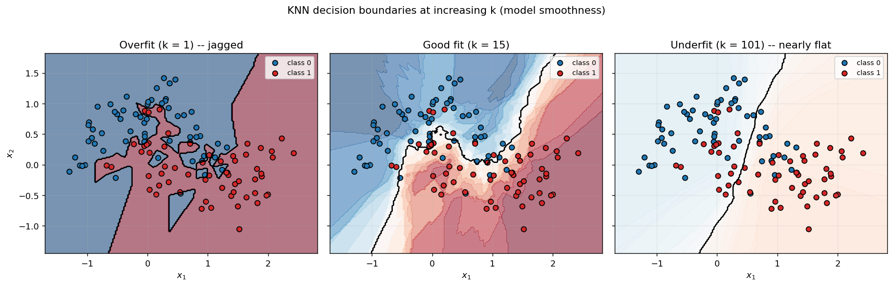
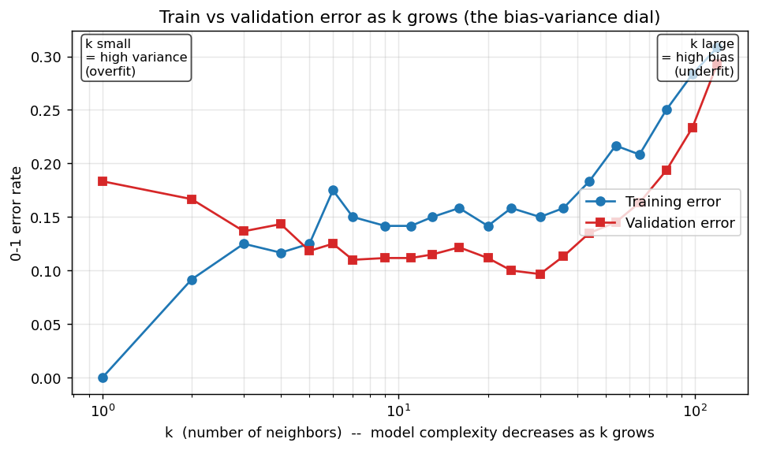
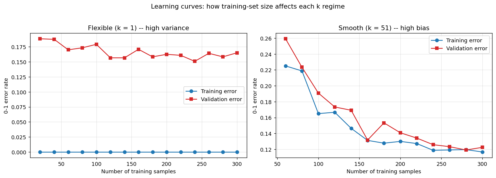
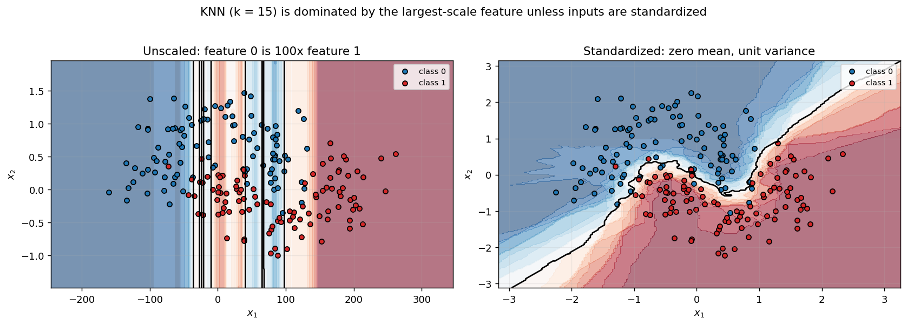

# k-Nearest Neighbors — Math, Code, and Practice

A companion to
[`k_nearest_neighbors.py`](./k_nearest_neighbors.py) and
[`distance.py`](./distance.py). The goal of this document is to walk
through *why* the code looks the way it does — the model, the distance
metric, the voting rule, what "fit" actually does, why there is no
training loop, and the familiar bias-variance trade-off, now playing
out as the choice of $k$ rather than as model capacity.

Math is rendered with LaTeX (`$...$`). GitHub, VS Code, and most modern
markdown viewers render this inline.

This is the third writeup in the series, and the first one for a
**non-parametric** model. If you have not already, the
[linear regression](../../regression/linear_regression.md) and
[logistic regression](../logistic_regression.md) docs introduce the
parametric framing that KNN deliberately breaks from — several sections
here cross-reference them.

## Table of contents

1. [Introduction](#1-introduction)
2. [The model](#2-the-model)
3. [Distance: Euclidean](#3-distance-euclidean)
4. [Voting](#4-voting)
5. [Worked example](#5-worked-example)
6. [No training — what "fit" actually does](#6-no-training--what-fit-actually-does)
7. [Extensions](#7-extensions)
8. [Overfitting and underfitting](#8-overfitting-and-underfitting)
9. [Further reading](#9-further-reading)

---

## 1. Introduction

**k-nearest neighbors** (KNN) is the simplest viable supervised learner.
To classify a query point $x$:

1. Compute the distance from $x$ to every point in the training set.
2. Pick the $k$ closest points — the **k nearest neighbors**.
3. Return whichever class is in the majority among those $k$.

That is the entire algorithm. There is no parameter vector $w$, no loss
function, no gradient descent, no iterative fit. The "model" is
literally the stored training set; all the work happens at prediction
time. This is what makes KNN **non-parametric** (model complexity is
not fixed by a finite parameter count — it grows with the data),
**instance-based** (predictions reference stored instances, not learned
parameters), and **lazy** (no work is done at fit time).

Contrast with the parametric models that came before:

|                          | linear regression / logistic regression | k-nearest neighbors                              |
| :----------------------- | :-------------------------------------- | :----------------------------------------------- |
| Model representation     | parameter vector $(w, b)$               | stored training set $(X_\text{train}, y_\text{train})$ |
| What "fit" does          | iterates gradient descent until convergence | copies the data onto the instance                |
| Cost of fit              | $O(\text{iterations} \cdot N \cdot n)$  | $O(N \cdot n)$ (one validation + memorize)       |
| Cost of one prediction   | $O(n)$                                  | $O(N \cdot n)$ (brute force)                     |
| Decision boundary        | a hyperplane in feature space           | piecewise — local "tiles" around each training point |
| Sensitive to             | feature scale, learning rate            | feature scale, $k$, distance metric              |

Despite the simplicity, KNN is surprisingly hard to beat on small
datasets with irregular decision boundaries — it is often the right
"first thing to try" before reaching for anything fancier. Its
weaknesses are also clear: it scales poorly to large $N$ (brute force
is $O(N)$ per query), it falls apart in high dimensions (the
[curse of dimensionality](#7-extensions)), and its predictions are
discrete and noisy at small $k$.

---

## 2. The model

There is no equation that *summarizes* a fitted KNN model the way
$\hat{y} = X w + b$ summarizes linear regression. The model **is** the
training set. The prediction equation is procedural:

For a query $x$, let $N_k(x) \subseteq \{1, \ldots, N\}$ be the indices
of the $k$ training points with the smallest distance to $x$:

$$N_k(x) = \arg\!\min_{S \subseteq \{1, \ldots, N\},\, |S| = k}
  \;\sum_{i \in S} d(x, x_i).$$

In words: the $k$ training-set indices whose distances $d(x, x_i)$ are
the smallest. Then the predicted **class-1 probability** is the
proportion of those neighbors with label 1:

$$\hat{p}(x) = \frac{1}{k} \sum_{i \in N_k(x)} y_i,$$

and the predicted **class label** is the threshold at $\tau$ (default
$0.5$):

$$\hat{y}(x) = \mathbb{1}\big[ \hat{p}(x) \geq \tau \big].$$

Why a *proportion* is a probability estimate: think of the $k$
neighbors' labels as a random sample of size $k$ drawn from the true
conditional distribution $P(y = 1 \mid x)$. The sample mean is the
maximum-likelihood estimate of that probability under a Bernoulli
model. Small $k$ gives a noisy estimate (high variance);
large $k$ averages over a larger neighborhood and gives a smoother
but more biased one. That trade-off is the entire content of
section 8.

Stacked over $M$ queries this whole procedure becomes:

1. **Distance matrix.** $D \in \mathbb{R}^{M \times N}$ with
   $D_{ij} = d(\text{query}_i, x_j)$. Built once via
   [`distance.euclidean`](./distance.py).
2. **Top-k indices per row.** A single `np.argpartition` along axis 1
   picks the $k$ smallest entries per row in $O(N)$ per row.
3. **Average gathered labels.** Index $y_\text{train}$ by the neighbor
   indices to get a shape-$(M, k)$ matrix of labels, then take the row
   mean.

This is exactly what
[`k_nearest_neighbors.predict`](./k_nearest_neighbors.py) does in three
vectorized lines. There is no Python loop over queries.

---

## 3. Distance: Euclidean

The **distance metric** is what makes "nearest" precise. KNN works for
*any* well-defined notion of distance, but the implementation in this
module uses **Euclidean distance** (the straight-line, "as the crow
flies" distance). For two vectors $a, b \in \mathbb{R}^n$:

$$d(a, b) = \sqrt{\sum_{j=1}^{n} (a_j - b_j)^2} = \|a - b\|_2.$$

Other metrics (Manhattan, Chebyshev, Minkowski, cosine, Hamming,
Levenshtein, Jaccard, Gower, …) are discussed in section 7.

### The vectorized identity

The textbook formula above suggests building a tensor of pairwise
differences $a_i - b_j$ and reducing — $O(M \cdot N \cdot n)$ memory.
That's wasteful. Expand the square:

$$\|a - b\|_2^2 = \|a\|_2^2 + \|b\|_2^2 - 2\, a \cdot b.$$

Apply this to *every* pair of query and training points simultaneously:

$$D^2_{ij} = \|q_i\|_2^2 + \|x_j\|_2^2 - 2\, q_i \cdot x_j.$$

The first two terms are vectors of per-point squared norms, broadcast
into the $(M, N)$ shape. The third is a single matrix product
$Q X_\text{train}^\top$, which is exactly what BLAS is good at:

```python
sq_query = (X_query ** 2).sum(axis=1)         # (M,)
sq_train = (X_train ** 2).sum(axis=1)         # (N,)
D2 = sq_query[:, None] + sq_train[None, :] - 2.0 * (X_query @ X_train.T)
D  = np.sqrt(np.maximum(D2, 0.0))             # clip roundoff
```

The clip-to-zero before `sqrt` guards against tiny negative values
produced by floating-point cancellation when $\|a - b\|$ is genuinely
near zero. This is the implementation in
[`distance.euclidean`](./distance.py).

### Why feature scaling matters

Euclidean distance treats all features as if they share the same units.
If one feature is "age in years" (range ~0–100) and another is "salary
in dollars" (range ~0–1,000,000), the salary feature will dominate the
distance computation by a factor of $10^4$ — the age feature
contributes essentially nothing. Concretely, for two samples differing
by 50 years in age and $1{,}000$ dollars in salary,

$$d = \sqrt{50^2 + 1000^2} \approx 1001.25.$$

The age difference is lost in the salary one. KNN therefore demands
that features be brought to comparable scales **before** computing
distances. The standard fix is to standardize:

$$x_j' = \frac{x_j - \mu_j}{\sigma_j}$$

per feature $j$. After standardization every feature contributes
roughly equally to $d$, and the decision boundary is determined by
the geometry of the data rather than by the units the data happened
to be reported in. See fig4 in section 8 for what happens when you
skip this step.

This sensitivity is a real departure from the parametric models. Linear
and logistic regression can *learn* to compensate for badly scaled
features by giving them small weights; KNN has no weights to adjust,
so the geometry has to be right going in.

---

## 4. Voting

After picking the $k$ neighbors, we have to aggregate their labels into
a single prediction. The class uses **uniform majority voting**: every
neighbor gets one vote, and the class with more votes wins. Equivalent
in the binary case to:

$$\hat{p}(x) = \frac{\#\{i \in N_k(x) : y_i = 1\}}{k},
  \qquad \hat{y}(x) = \mathbb{1}[\hat{p}(x) \geq 0.5].$$

A few notes on what the code is and isn't doing:

* **Tie-breaking.** With binary labels and odd $k$, ties are impossible
  — exactly one class has more than $k/2$ votes. For even $k$ a tie
  $\hat{p}(x) = 0.5$ resolves to class 1 (the `>=` rule in
  [`predict_class`](./k_nearest_neighbors.py)), matching the
  `logistic_regression.predict_class` convention. If that matters, pick
  odd $k$.
* **Probabilities are quantized.** Because we are averaging $k$ binary
  values, $\hat{p}(x)$ can only take the values $0/k, 1/k, \ldots,
  k/k$. With $k = 5$ that is six possible probability values per
  query; with $k = 1$ it is just $\{0, 1\}$. This is a stark contrast
  with logistic regression, whose probabilities live in the full
  interval $(0, 1)$.
* **Multiclass.** For $K > 2$ classes the natural generalization is
  argmax over per-class counts. The code in this module is binary-only
  and validates that `y` is in $\{0, 1\}$, mirroring
  `logistic_regression`. See section 7 for the multiclass slot-in.
* **Distance-weighted voting.** A common variant weights closer
  neighbors more heavily — usually inversely with distance. The
  uniform rule above is the special case where every weight is $1$.
  See section 7.

---

## 5. Worked example

Concrete numbers make this stick. Consider eight 2D training points and
their labels:

| Index $i$ | $x_i$       | $y_i$ |
| :-------- | :---------- | :---: |
| 1         | $(1, 1)$    | 0     |
| 2         | $(1, 2)$    | 0     |
| 3         | $(2, 1)$    | 0     |
| 4         | $(2, 2)$    | 0     |
| 5         | $(4, 4)$    | 1     |
| 6         | $(4, 5)$    | 1     |
| 7         | $(5, 4)$    | 1     |
| 8         | $(5, 5)$    | 1     |

Four points clustered near $(1.5, 1.5)$ with label 0, four points
clustered near $(4.5, 4.5)$ with label 1. Classify the query
$x = (3, 3)$ — squarely between the two clusters — using $k = 3$.

**Step 1: distance to each training point.** With Euclidean distance:

| $i$ | $x_i$    | $x_i - x$  | $\|x_i - x\|_2^2$ | $d(x_i, x)$        |
| :-: | :------- | :--------- | ----------------: | :----------------- |
| 1   | $(1, 1)$ | $(-2, -2)$ | $8$               | $2\sqrt{2} \approx 2.83$ |
| 2   | $(1, 2)$ | $(-2, -1)$ | $5$               | $\sqrt{5} \approx 2.24$ |
| 3   | $(2, 1)$ | $(-1, -2)$ | $5$               | $\sqrt{5} \approx 2.24$ |
| 4   | $(2, 2)$ | $(-1, -1)$ | $2$               | $\sqrt{2} \approx 1.41$ |
| 5   | $(4, 4)$ | $(1, 1)$   | $2$               | $\sqrt{2} \approx 1.41$ |
| 6   | $(4, 5)$ | $(1, 2)$   | $5$               | $\sqrt{5} \approx 2.24$ |
| 7   | $(5, 4)$ | $(2, 1)$   | $5$               | $\sqrt{5} \approx 2.24$ |
| 8   | $(5, 5)$ | $(2, 2)$   | $8$               | $2\sqrt{2} \approx 2.83$ |

**Step 2: pick the $k = 3$ smallest distances.** Indices 4 and 5 tie
at $\sqrt{2}$. Beyond them, four indices tie at $\sqrt{5}$: 2, 3, 6, 7.
We need just one of those four for our third neighbor; ties at the
boundary are arbitrarily broken (in NumPy, by `argpartition`'s
implementation). Say the third neighbor is index 2.

The three nearest neighbors are $\{4, 5, 2\}$ with labels $\{0, 1, 0\}$.

**Step 3: vote.**

$$\hat{p}(x) = \tfrac{1}{3} (0 + 1 + 0) = \tfrac{1}{3} \approx 0.33.$$

Since $0.33 < 0.5$, the predicted class is **0**.

This is "the closer cluster is closer" reasoning made literal. Increase
$k$ to 4 and the vote changes — now we include both points at distance
$\sqrt{2}$ and any two of the four tied at $\sqrt{5}$, giving labels
like $\{0, 1, 0, 1\}$ for $\hat{p} = 0.5$ and a tie. This is why even
$k$ is awkward in binary classification, and why most practitioners
pick odd $k$.

To run the same thing in code:

```python
import numpy as np
from ml_from_scratch.classification.k_nearest_neighbors.k_nearest_neighbors \
    import k_nearest_neighbors

X = np.array([[1, 1], [1, 2], [2, 1], [2, 2],
              [4, 4], [4, 5], [5, 4], [5, 5]], dtype=float)
y = np.array([0, 0, 0, 0, 1, 1, 1, 1])

clf = k_nearest_neighbors(k=3)
clf.fit(X, y)

query = np.array([3.0, 3.0])
print(clf.predict(query))         # ~ [0.333...]
print(clf.predict_class(query))   # [0]
```

---

## 6. No training — what "fit" actually does

[`k_nearest_neighbors.fit`](./k_nearest_neighbors.py) validates the
shape and label values of the inputs, copies them onto `self.X_train`
and `self.y_train`, and returns. That is the entire "training" step.
There is no iteration, no learning rate, no convergence criterion, no
"final weights" to print. The companion class deliberately omits the
`train`/`train_one_step` methods that the other models expose — they
would not represent anything.

The cost has just been **shifted to prediction time**. Compare:

| Step       | logistic_regression                              | k_nearest_neighbors                   |
| :--------- | :----------------------------------------------- | :------------------------------------ |
| Fit        | $O(\text{iters} \cdot N \cdot n)$ — GD until converged | $O(N \cdot n)$ — validate + copy      |
| One query  | $O(n)$ — one dot product through `sigmoid`       | $O(N \cdot n)$ — distance to every point |
| Memory     | $O(n)$ — store $(w, b)$                          | $O(N \cdot n)$ — store every training point |

For small $N$ (a few thousand) this trade is fine. For large $N$ the
per-query cost is painful and a few standard tricks apply:

* **Spatial-index data structures** — a
  [**KD-tree**](https://en.wikipedia.org/wiki/K-d_tree) or
  [**Ball tree**](https://en.wikipedia.org/wiki/Ball_tree) preprocesses
  the training set once at $O(N \log N)$ and reduces per-query cost to
  roughly $O(\log N \cdot n)$ in low dimensions. They lose effectiveness
  as $n$ grows: above ~20 dimensions, brute force often wins.
* **Approximate nearest neighbors** —
  [HNSW](https://arxiv.org/abs/1603.09320) or
  [FAISS](https://github.com/facebookresearch/faiss) give sub-linear
  search at the cost of occasionally missing the true nearest neighbor,
  which is usually fine downstream.

The implementation in this module is intentionally **brute force** —
$M$ queries times $N$ training points is one $M \times N$ matrix
distance and one `argpartition`. That makes the algorithm visible:
the math in the docstrings *is* the code in the file. Adding a KD-tree
would obscure the lesson without changing anything pedagogically.

### Why "no closed form" is the wrong question

For linear regression we
[derived the normal equation](../../regression/linear_regression.md#7-closed-form-alternative-the-normal-equation)
as the closed-form alternative to gradient descent. For logistic
regression we
[noted](../logistic_regression.md#7-no-closed-form--and-what-stands-in)
that no closed form exists, and IRLS / Newton's method takes its place.
For KNN the question does not apply: there are no parameters to solve
for. The output of "training" is the dataset itself; there is no
optimization being done that a closed form could short-circuit.

---

## 7. Extensions

The class in this module is intentionally minimal: binary
classification, Euclidean distance, uniform voting, brute-force search.
Below is the landscape of common extensions and where each would slot
in.

### Other distance metrics

Euclidean is the $p = 2$ special case of the **Minkowski distance**:

$$d_p(a, b) = \left( \sum_{j=1}^{n} |a_j - b_j|^p \right)^{1/p}.$$

Common members:

* **Manhattan** / city block ($p = 1$) —
  $d_1(a, b) = \sum_j |a_j - b_j|$. Each axis-aligned move costs its
  own length; the unit "ball" is a diamond. Good when features
  correspond to literally independent dimensions (e.g. street grids,
  pixel intensities) and you do not want one large coordinate
  difference to dominate.
* **Chebyshev** / $L^\infty$ ($p \to \infty$) —
  $d_\infty(a, b) = \max_j |a_j - b_j|$. Distance is the largest
  per-feature gap. The unit ball is a square. Good when you care
  about the worst-coordinate disagreement.
* **Minkowski** for arbitrary $p$ — interpolates between Manhattan
  and Chebyshev. Rarely tuned in practice; usually fixed at $p = 2$.
* **Cosine** distance —
  $d_{\cos}(a, b) = 1 - \frac{a \cdot b}{\|a\|\, \|b\|}$. Ignores
  magnitudes, looks only at the angle between vectors. The default
  for text embeddings, recommender systems, and other settings where
  "two things point the same way" is what matters and the magnitude
  reflects something irrelevant (like document length).

Slot in: add a new function to [`distance.py`](./distance.py) with the
same `(X_query, X_train) -> (M, N)` signature, add its name to
`DISTANCE_METRICS`, add a `distance` parameter to `__init__`, and
dispatch on it in `predict`. (The same pattern as adding a new loss to
`logistic_regression`.)

### Distance for non-numeric data

Real datasets often include features that are not numeric — strings,
categories, sets, sequences. Computing a meaningful "distance" between
two records then requires either picking a metric defined directly on
the data type, or encoding the data into a vector space first.

* **Hamming distance** — number of positions where two equal-length
  strings (or one-hot vectors, or binary feature vectors) differ.
  $d_H(\text{"cat"}, \text{"cap"}) = 1$. The natural metric for
  categorical features after one-hot encoding, and for binary
  fingerprints in cheminformatics. Identical to Manhattan distance
  on $\{0, 1\}^n$.
* **Levenshtein (edit) distance** — minimum number of insertions,
  deletions, and substitutions to turn one variable-length string
  into another. Used for fuzzy text matching, spelling correction,
  DNA-sequence alignment. Variants include Damerau-Levenshtein
  (adds transposition) and weighted edit distance.
* **Jaccard distance** for sets —
  $d_J(A, B) = 1 - |A \cap B| / |A \cup B|$. Good for "documents as
  bags of words", overlapping interests in recommender systems,
  shingled-text similarity.
* **Gower distance** — a mixed-type generalization that computes a
  per-feature similarity using whichever sub-metric is appropriate
  for each column (numeric → scaled L^1, categorical → Hamming,
  ordinal → ranks), then averages. The standard choice for
  heterogeneous tabular data, e.g. a record with age (numeric),
  occupation (categorical), and education level (ordinal).
* **The "encode then embed" pattern.** Often the most practical
  approach is to convert non-numeric data into a real-valued vector
  via one-hot encoding (low cardinality), target encoding (high
  cardinality), or a learned embedding (text, images, graphs), and
  then run KNN with a numeric metric (usually Euclidean or cosine)
  on the embeddings. Modern semantic search is essentially KNN over
  sentence embeddings using cosine distance — the embeddings
  themselves come from a pretrained model like
  [`sentence-transformers`](https://www.sbert.net/).

Slot in: same as for numeric metrics — add a function to
`distance.py`. For variable-length inputs you may need to relax the
"X is an $(N, n)$ matrix" assumption and pass through a list of
records instead; the dispatch in `predict` still works the same way.

### Distance-weighted voting

Uniform voting gives every neighbor the same say even though some are
much closer than others. **Distance-weighted** voting fixes that:
weight neighbor $i$ by $w_i = 1 / (d_i + \varepsilon)$ (or
$w_i = e^{-d_i / \sigma}$), and predict

$$\hat{p}(x) = \frac{\sum_{i \in N_k(x)} w_i \cdot y_i}{\sum_{i \in N_k(x)} w_i}.$$

This usually makes the predictions less sensitive to the exact choice
of $k$ — far-away neighbors contribute less even at large $k$ — and
breaks the "probabilities are quantized" property. The trade-off is
one more hyperparameter and a slightly more complex
[`predict`](./k_nearest_neighbors.py) implementation.

Slot in: add a `weights="uniform" | "distance"` argument to `__init__`,
gather both the labels *and* the distances at the chosen indices in
`predict`, and replace the `.mean(axis=1)` with the weighted-average
expression above.

### Feature scaling

Already discussed in section 3. In practice this is the single biggest
thing you can do to make KNN work on real-world tabular data. Standard
choices:

* **Standardization** —
  $x' = (x - \mu) / \sigma$ per feature. Default for roughly Gaussian
  features.
* **Min-max scaling** —
  $x' = (x - \min) / (\max - \min)$ per feature. Default for
  bounded-range features (image pixel intensities, percentages).
* **Robust scaling** —
  use the median and IQR instead of mean and standard deviation.
  Better when features have heavy-tailed distributions or outliers.

Slot in: this is a *preprocessing* step, not a change to the KNN class.
Compute the scaling parameters from the training set, apply them to
both training and query inputs before calling
[`fit`](./k_nearest_neighbors.py) and `predict`.

### Curse of dimensionality

In high dimensions, **all pairwise distances concentrate** — the
distance from a query to its nearest neighbor and to its farthest
neighbor become nearly equal. A common result: for points uniformly
distributed in $[0, 1]^n$, the ratio $d_\text{max} / d_\text{min} \to 1$
as $n \to \infty$. "Nearest" loses its meaning, and KNN's
distance-based reasoning collapses.

Symptoms in practice: KNN works well on a small handful of features
and degrades sharply as more (potentially irrelevant) features are
added. Mitigations:

* **Feature selection** — drop features that do not carry signal.
* **Dimensionality reduction** — PCA, autoencoders, learned
  embeddings.
* **Different metrics** — cosine distance often suffers less than
  Euclidean.
* **Use a different model** — past ~50 dimensions KNN is rarely the
  right tool; trees and linear models cope much better.

### KD-trees and Ball trees

The brute-force `(M, N)` distance matrix is wasteful: most queries do
not actually need the distance to most training points, only to the
few nearby ones. Spatial-index data structures encode this:

* **KD-tree** — recursive axis-aligned partitioning. Each internal
  node splits the training points by a single feature. Queries
  descend the tree pruning branches whose minimum possible distance
  exceeds the current best $k$-th distance.
* **Ball tree** — recursive partitioning by enclosing balls (sphere
  in $\mathbb{R}^n$). More robust to non-axis-aligned data
  geometry and to moderate dimensions.

Both bring per-query cost from $O(N)$ down to roughly $O(\log N)$ in
low dimensions, at the cost of $O(N \log N)$ preprocessing. In high
dimensions they degrade back to brute force; approximate methods
(HNSW, IVF, FAISS) take over from there.

Slot in: this is an internal optimization of the distance computation
in [`predict`](./k_nearest_neighbors.py). The `predict` API does not
change — calling code does not care whether the search is brute force
or tree-accelerated. Real-world libraries (sklearn, FAISS) expose this
as an algorithm hyperparameter (`algorithm="auto" | "brute" | "kd_tree" | "ball_tree"`).

### KNN for regression

The exact same algorithm works for regression. Replace the majority
vote with the (possibly weighted) mean of the $k$ nearest training
targets:

$$\hat{y}(x) = \frac{1}{k} \sum_{i \in N_k(x)} y_i.$$

The prediction surface is piecewise constant (with uniform weights)
or piecewise smooth (with distance weights). All the same diagnostics
apply: small $k$ overfits, large $k$ regresses toward the global mean,
feature scaling still matters.

Slot in: a `task="classification" | "regression"` parameter, dispatch
on it in `predict`, and skip the `y in {0, 1}` validation in `fit` for
the regression case. (Or two separate classes — a stylistic choice.)

### Multi-class extension

For $K > 2$ classes, replace the binary majority vote with argmax
over per-class neighbor counts:

$$\hat{y}(x) = \arg\!\max_{c \in \{1, \ldots, K\}}
  \;\#\{i \in N_k(x) : y_i = c\}.$$

In code this is `np.bincount` per query (one count vector of length
$K$, then `argmax`). The probability output becomes a row of length
$K$ — the class-$c$ proportion in the neighborhood — replacing the
single scalar in the binary case.

### Choosing $k$

Cross-validation. There is no closed-form best $k$ — pick the value
that minimizes validation error. Some practical rules of thumb:

* Start with $k \approx \sqrt{N}$ as an order-of-magnitude guess.
* Prefer odd $k$ for binary classification (no ties).
* Try $k \in \{1, 3, 5, 9, 15, 25, 51, \ldots\}$ on a log scale,
  not $k \in \{1, 2, 3, \ldots\}$ — the difference between $k = 50$
  and $k = 51$ matters less than the difference between $k = 1$ and
  $k = 5$.

Section 8 shows what the train/val curve looks like as $k$ varies.

---

## 8. Overfitting and underfitting

For parametric models, model complexity was set by feature engineering
(polynomial degree in
[linear regression](../../regression/linear_regression.md#9-overfitting-and-underfitting)
and
[logistic regression](../logistic_regression.md#9-overfitting-and-underfitting))
and tamed with regularization. For KNN, **the complexity dial is $k$
itself.** Small $k$ means a flexible, "trust the nearest training
point" model — high variance, low bias. Large $k$ means a smoothed,
"average over a wide neighborhood" model — low variance, high bias.

Figures are generated by
[`generate_plots.py`](./generate_plots.py) — run
`python generate_plots.py` to regenerate.

### Underfit, good fit, overfit



Same two-moons dataset; the boundary is computed by KNN at three
different $k$:

* **$k = 1$** — the boundary contorts around every training point,
  forming little islands of one class deep inside the other class's
  region. Training error is exactly zero (every point is its own
  nearest neighbor), but generalization is poor: tiny changes to the
  training data would shift the boundary wildly. High **variance**.
* **$k = 15$** — smooth, follows the moons' actual curvature without
  chasing individual mislabeled-looking points. The "sweet spot" for
  this dataset and noise level.
* **$k = 101$** — the boundary has nearly collapsed to a straight line
  reflecting only the global class balance. With $N = 120$ training
  points, $k = 101$ means "average over almost everything", which
  destroys local structure. High **bias**.

This mirrors the polynomial-degree story for logistic regression, but
with the dial running in the *opposite* direction — small $k$ is the
high-complexity end, not the low-complexity end. The intuition is
worth pausing on: $k$ is the *size of the neighborhood we are
averaging over*, not the number of degrees of freedom in a function.
A bigger neighborhood smooths more.

### The complexity curve



Sweep $k$ from 1 to $N - 1$ on a log scale:

* **Training error is 0 at $k = 1$** — every training point is its
  own nearest neighbor — and rises monotonically with $k$ as the
  averaging neighborhood grows wider. This is the *reverse* of the
  polynomial-degree complexity curve, where training error decreased
  with more complexity.
* **Validation error is U-shaped.** It starts moderately high at
  $k = 1$ (the boundary is jagged and chases noise), drops to a
  minimum around $k = 15$ – $30$, and then climbs again as the model
  starts ignoring the data's local structure.

The minimum of the validation curve is what cross-validation picks.
Note that the *training* curve gives no signal about the right $k$ —
the best training fit ($k = 1$) is the worst generalizer. Always
choose $k$ on held-out data.

### Learning curves



Now hold $k$ fixed and sweep the training-set size $N$:

* **$k = 1$ (left):** training error stays pinned at 0 — each point
  is always its own nearest neighbor. Validation error drops as $N$
  grows but a persistent gap between train and val remains, which
  is the signature of **variance**. More data helps but does not
  close the gap.
* **$k = 51$ (right):** at small $N$, $k = 51$ means we are averaging
  over almost the entire training set — the prediction is close to
  the global majority class everywhere. As $N$ grows the
  neighborhood of size 51 becomes a smaller fraction of the data
  and the predictions become more local, so both training and
  validation error decrease, and the two curves run close together.

The diagnostic value of these curves is the same as for the
parametric models: a persistent train/val gap (left panel) means
variance — collect more data or smooth more; a high error floor that
both curves reach (right panel, at small $N$) means bias — try a
smaller $k$ or richer features.

### Feature scaling



Same dataset as fig1 but with one feature deliberately inflated by
$100\times$ before fitting. On the left, KNN's Euclidean distance is
dominated almost entirely by feature 0; feature 1 contributes
negligibly, and the decision boundary becomes a near-vertical strip
that ignores the moons' actual structure. On the right, the inputs
are standardized to zero mean and unit variance before fitting and
the proper curved boundary is recovered.

This is the same dataset, the same code, the same $k$. The only
difference is whether the inputs are on comparable scales. The
parametric models could compensate via weights; KNN cannot. **Scale
your features.**

---

## 9. Further reading

* Hastie, Tibshirani, Friedman — *The Elements of Statistical
  Learning*, chapter 13. The standard reference on prototype and
  nearest-neighbor methods, including the
  [Cover-Hart](https://www.cs.cornell.edu/courses/cs4780/2018fa/lectures/lecturenote02_kNN.html)
  result that 1-NN's asymptotic error is at most twice the Bayes
  optimal.
* Cover & Hart, 1967, *Nearest neighbor pattern classification*. The
  original asymptotic analysis. Short, readable, foundational.
* [scikit-learn user guide: nearest neighbors](https://scikit-learn.org/stable/modules/neighbors.html)
  — production-grade reference implementation with KD-tree, Ball tree,
  metric choices, and distance-weighted voting all exposed as
  hyperparameters.
* Bishop — *Pattern Recognition and Machine Learning*, section 2.5.
  Connects KNN density estimation (the "Parzen window" view) to KNN
  classification via Bayes' rule; a satisfying way to see *why* the
  majority-vote rule is principled rather than ad-hoc.
* [Annoy](https://github.com/spotify/annoy), [HNSW](https://arxiv.org/abs/1603.09320),
  [FAISS](https://github.com/facebookresearch/faiss) — modern
  approximate-nearest-neighbor libraries used in production for
  large-scale similarity search.
