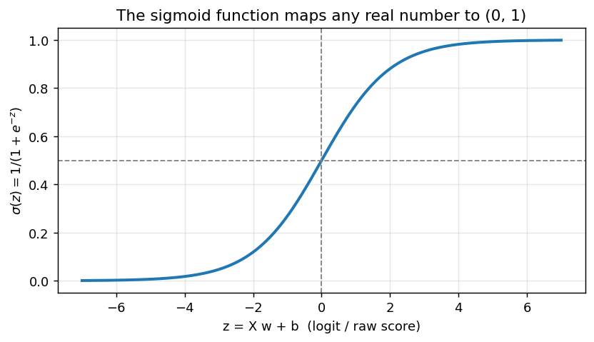
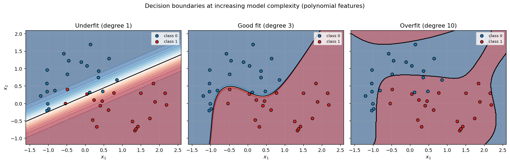
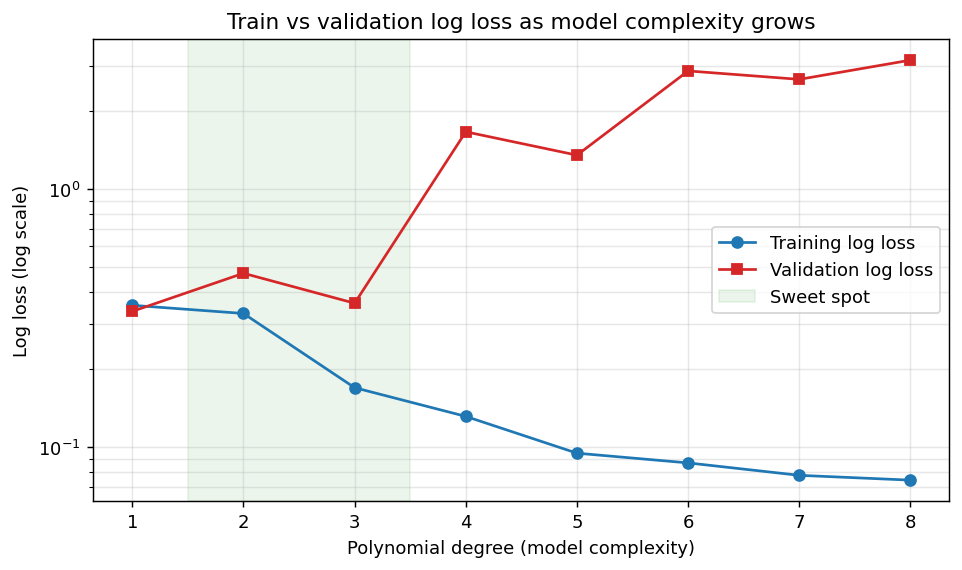
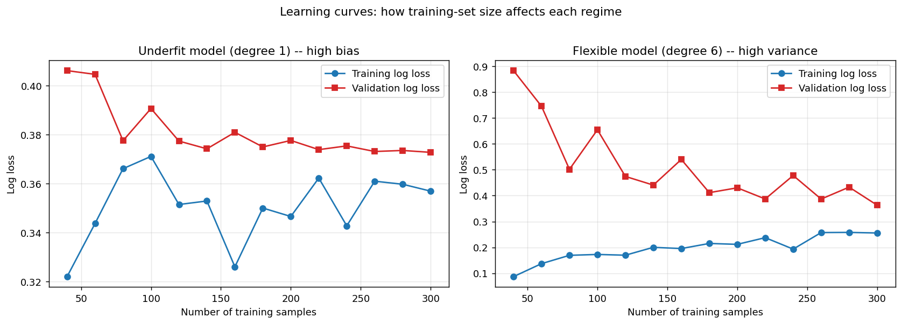
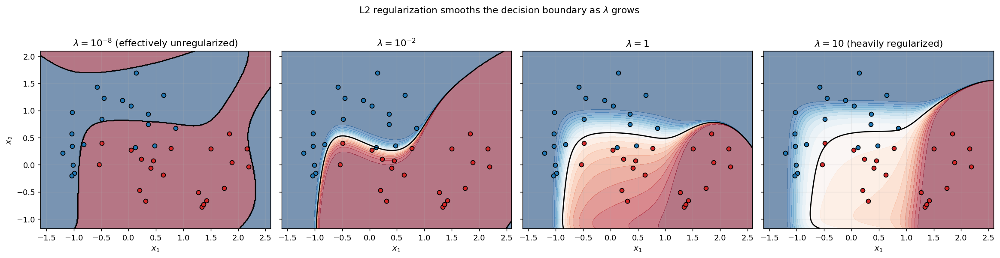

# Logistic Regression — Math, Code, and Practice

A companion to [`logistic_regression.py`](./logistic_regression.py) and
[`loss.py`](./loss.py). The goal of this document is to walk through *why*
the code looks the way it does — the model, the loss functions, the
gradient derivations (including the beautifully clean BCE-plus-sigmoid
result), why there is *no* closed form, the analog (IRLS), common
extensions, and the same bias-variance trade-off we saw in linear
regression but now playing out as decision-boundary complexity.

Math is rendered with LaTeX (`$...$`). GitHub, VS Code, and most modern
markdown viewers render this inline.

If you have not already, read the
[linear-regression companion doc](../regression/linear_regression.md) first
— logistic regression is the natural next step from there, and several
sections cross-reference it.

## Table of contents

1. [Introduction](#1-introduction)
2. [The model](#2-the-model)
3. [Loss functions](#3-loss-functions)
4. [Gradient descent](#4-gradient-descent)
5. [Gradient derivations](#5-gradient-derivations)
6. [Worked example](#6-worked-example)
7. [No closed form — and what stands in](#7-no-closed-form--and-what-stands-in)
8. [Extensions](#8-extensions)
9. [Overfitting and underfitting](#9-overfitting-and-underfitting)
10. [Further reading](#10-further-reading)

---

## 1. Introduction

**Logistic regression** is the workhorse model for **binary
classification**: predicting which of two classes an input belongs to.
The output is not the class itself but the *probability* of class 1:

$$P(y = 1 \mid x) = \sigma(x \cdot w + b), \qquad
  \sigma(z) = \frac{1}{1 + e^{-z}}.$$

If linear regression asks "how much *amount*?", logistic regression asks
"how much *evidence*?" — and turns that evidence into a probability.

The link to linear regression is intentional. Both models compute the
same linear score $z = x \cdot w + b$:

* Linear regression *uses* that score directly as the prediction.
  Unbounded real-valued outputs are fine when you are predicting a
  continuous target (price, temperature, length).
* Logistic regression *squashes* the score through the sigmoid to make
  it a probability in $(0, 1)$. The score itself becomes the **log-odds**
  of the positive class (more on this in section 2).

Despite the name, logistic regression is a **classifier**, not a
regressor. The "regression" comes from the linear regression of
log-odds on features — historical naming. It is the right starting
tool whenever you suspect a roughly linear decision boundary, want
calibrated probabilities (not just labels), or need a fast,
interpretable baseline before reaching for trees or neural nets.

---

## 2. The model

For one sample with $n$ features:

$$z_i = x_i \cdot w + b = \sum_{j=1}^{n} x_{ij} w_j + b,
  \qquad \hat{p}_i = \sigma(z_i).$$

Stacking $N$ samples as rows of a matrix $X \in \mathbb{R}^{N \times n}$
turns the whole batch into a single matrix expression:

$$z = X w + b, \qquad \hat{p} = \sigma(z),$$

where:

| Symbol     | Shape    | Meaning |
| :--------- | :------- | :------ |
| $X$        | $(N, n)$ | input feature matrix — one row per sample |
| $w$        | $(n,)$   | weight vector — one weight per feature |
| $b$        | scalar   | bias / intercept |
| $z$        | $(N,)$   | linear scores / **logits** |
| $\hat{p}$  | $(N,)$   | predicted probabilities, $P(y_i = 1 \mid x_i)$ |
| $y$        | $(N,)$   | true labels, each in $\{0, 1\}$ |

This is exactly what
[`logistic_regression.predict`](./logistic_regression.py) computes — the
combination `sigmoid(X @ self.w + self.b)` handles all $N$ samples in
two NumPy operations, no Python loop over samples.

### The sigmoid function



The sigmoid $\sigma(z) = 1 / (1 + e^{-z})$ maps any real number to
$(0, 1)$:

* $z \to -\infty \Rightarrow \sigma(z) \to 0$
* $z = 0 \Rightarrow \sigma(0) = 0.5$
* $z \to +\infty \Rightarrow \sigma(z) \to 1$
* $\sigma$ is monotonically increasing and smooth (differentiable everywhere)
* $\sigma'(z) = \sigma(z) (1 - \sigma(z))$ — a tidy identity we will use in
  the gradient derivations

The derivative identity falls out of the quotient rule on $1/(1 + e^{-z})$
and is what makes the BCE gradient simplify so cleanly.

### Log-odds: where sigmoid comes from

Why sigmoid and not some other squashing function? Solve $\sigma(z) = p$
for $z$:

$$z = \log \frac{p}{1 - p}.$$

The right-hand side is the **log-odds** (or **logit**) of $p$ — the
log of the ratio of "yes" probability to "no" probability. Logistic
regression therefore models log-odds as a linear function of features:

$$\log \frac{P(y = 1 \mid x)}{P(y = 0 \mid x)} = x \cdot w + b.$$

Each weight $w_j$ has a clean interpretation: increasing feature $j$ by
one unit *adds* $w_j$ to the log-odds, equivalently *multiplies* the
odds by $e^{w_j}$. That is why logistic-regression coefficients are
sometimes reported as "odds ratios".

### The decision boundary is linear

To convert probabilities into discrete class predictions, threshold at
some value $\tau$ (default $0.5$). Because $\sigma$ is monotone,
$\hat{p} \geq 0.5 \Leftrightarrow z \geq 0$, so the boundary
$\hat{p} = 0.5$ is exactly the hyperplane

$$X w + b = 0.$$

Logistic regression is therefore a **linear classifier**: its decision
boundary is always flat in feature space. Curved boundaries come from
feeding it nonlinear features (e.g. polynomial expansions of the
inputs) — exactly the same trick that lets linear regression fit
polynomials. See section 9 for what that looks like.

---

## 3. Loss functions

A **loss function** measures how wrong the predictions are. Training
picks $w, b$ to minimize it. The three losses in
[`loss.py`](./loss.py) are listed below. For each, write $p_i$ for the
predicted probability and $z_i$ for the underlying logit, where
$p_i = \sigma(z_i)$.

### Binary Cross-Entropy (BCE) — a.k.a. log loss

$$L_{\text{BCE}}(w, b) = -\frac{1}{N} \sum_{i=1}^{N}
  \Big[ y_i \log p_i + (1 - y_i) \log (1 - p_i) \Big]$$

The canonical loss for logistic regression. It is the negative
log-likelihood of the data under the Bernoulli model
$y_i \sim \text{Bernoulli}(p_i)$, so minimizing BCE is exactly maximum
likelihood. It is also **convex** in $(w, b)$, so gradient descent
converges to the unique global optimum (slow or fast, but never to a
wrong answer).

### Hinge loss — the SVM loss

Hinge is most naturally written with labels in $\{-1, +1\}$. Convert
incoming $y \in \{0, 1\}$ via $\tilde{y} = 2 y - 1$. Then:

$$L_{\text{Hinge}}(w, b) = \frac{1}{N} \sum_{i=1}^{N}
  \max\Big(0,\; 1 - \tilde{y}_i z_i \Big).$$

The loss is zero whenever the score has the correct sign *and* magnitude
$\geq 1$, i.e. the sample is on the right side of the **margin**;
otherwise it grows linearly. Optimizing it with an L2 penalty on $w$
recovers a linear Support Vector Machine. Compared to BCE, hinge gives
zero gradient on confidently-correct samples — they stop pulling on the
boundary at all — which often produces sparser, geometrically cleaner
decision boundaries. It is non-smooth at the kink $\tilde{y} z = 1$;
we use the standard subgradient (active = 0 at the kink).

### Mean Squared Error on probabilities — a.k.a. the Brier score

$$L_{\text{MSE}}(w, b) = \frac{1}{N} \sum_{i=1}^{N} (y_i - p_i)^2$$

The same MSE that worked beautifully for linear regression, now applied
to probabilities. It is included here mainly as a cautionary
comparison: with a sigmoid sitting between the parameters and the
prediction, MSE is **not convex** in $(w, b)$ and its gradient picks
up an extra $p(1 - p)$ factor (see section 5). When the model is
confidently wrong (e.g. $p = 0.99$ when $y = 0$), that factor is near
zero — *the gradient vanishes precisely when you most want it to be
large*. This is sometimes called the "vanishing-gradient" problem of
MSE for classification. BCE has no such issue.

| Loss | Best when | Watch out for |
| :--- | :-------- | :------------ |
| BCE  | you want maximum-likelihood probabilities; the default for logistic regression | overflow in naive $\log(1 - p)$ at $p \to 1$ — clip $p$ to $[\varepsilon, 1 - \varepsilon]$ |
| Hinge | you want max-margin classification (linear SVM); only labels matter, not probabilities | not smooth at the margin; predicted "probabilities" via sigmoid are not calibrated |
| MSE (Brier) | pedagogical comparison; calibration metric (used post-hoc, not for training) | non-convex; vanishing gradient when confidently wrong |

---

## 4. Gradient descent

Given any differentiable loss $L(\theta)$, **gradient descent**
repeatedly nudges the parameters in the direction of steepest decrease:

$$\theta \leftarrow \theta - \alpha \, \nabla_\theta L(\theta).$$

For logistic regression $\theta = (w, b)$ and we apply this to each:

$$w \leftarrow w - \alpha \, \frac{\partial L}{\partial w}, \qquad
  b \leftarrow b - \alpha \, \frac{\partial L}{\partial b}.$$

This is the same algorithm and the same learning-rate intuition as in
the [linear-regression doc](../regression/linear_regression.md#4-gradient-descent)
— refer there for the "too small / too large / just right" picture.
Each call to
[`logistic_regression.train_one_step`](./logistic_regression.py)
implements exactly this update. The convergence loop in
[`logistic_regression.train`](./logistic_regression.py) stops when
either the iteration cap is hit or successive errors differ by less
than the cutoff.

One detail that *is* different: for BCE, the loss surface is convex but
**not strongly convex** when the classes are linearly separable — the
optimum is at infinity (push the boundary out until every training
point is on the correct side, then push it further forever). In
practice this manifests as weights growing without bound. Adding a
small L2 penalty (section 8) fixes this and is standard.

---

## 5. Gradient derivations

We need $\partial L / \partial w_j$ and $\partial L / \partial b$ for
each loss. The shared chain starts with $z_i = x_i \cdot w + b$, so

$$\frac{\partial z_i}{\partial w_j} = x_{ij}, \qquad
  \frac{\partial z_i}{\partial b} = 1.$$

What changes between losses is how the loss depends on $z_i$ (sometimes
directly, sometimes via $p_i = \sigma(z_i)$). We will compute
$\partial L / \partial z_i$ for each loss and then sum the chain over
samples.

### BCE — the clean cancellation

Start with one sample:

$$\ell_i = -\Big[ y_i \log p_i + (1 - y_i) \log (1 - p_i) \Big].$$

Differentiate with respect to $p_i$:

$$\frac{\partial \ell_i}{\partial p_i}
  = -\frac{y_i}{p_i} + \frac{1 - y_i}{1 - p_i}
  = \frac{p_i - y_i}{p_i (1 - p_i)}.$$

Now use $p_i = \sigma(z_i)$ and the sigmoid identity
$\sigma'(z) = p(1 - p)$:

$$\frac{\partial \ell_i}{\partial z_i}
  = \frac{\partial \ell_i}{\partial p_i} \cdot \frac{\partial p_i}{\partial z_i}
  = \frac{p_i - y_i}{p_i (1 - p_i)} \cdot p_i (1 - p_i)
  = p_i - y_i.$$

The $p(1 - p)$ from the sigmoid derivative cancels the $p(1 - p)$ from
the BCE derivative. That cancellation is the famous "BCE + sigmoid
gives a clean gradient" result and is the single biggest reason BCE is
the canonical classification loss.

Averaging over $N$ samples and chaining through $z_i$:

$$\boxed{\;
\frac{\partial L_{\text{BCE}}}{\partial w_j}
  = \frac{1}{N} \sum_{i=1}^{N} (p_i - y_i) \, x_{ij}
  = \frac{1}{N} \big( X^\top (\hat{p} - y) \big)_j,
\qquad
\frac{\partial L_{\text{BCE}}}{\partial b}
  = \frac{1}{N} \sum_{i=1}^{N} (p_i - y_i).
\;}$$

Compare to the MSE gradient for linear regression:

$$\frac{\partial L_{\text{MSE}}}{\partial w_j}
  = -\frac{2}{N} \big( X^\top (y - \hat{y}) \big)_j.$$

The structure is the same: a vectorized matrix-vector product of $X^\top$
with a residual. The "residual" for BCE is $(\hat{p} - y)$ instead of
$(y - \hat{y})$ — i.e. probabilities versus continuous predictions —
but the code shape `X.T @ residual` is identical.

### Hinge — subgradient at the kink

Convert labels: $\tilde{y}_i = 2 y_i - 1$. Define the per-sample margin
violation

$$m_i = 1 - \tilde{y}_i z_i.$$

Then $\ell_i = \max(0, m_i)$. This function is differentiable except at
$m_i = 0$; on either side:

$$\frac{\partial \max(0, m_i)}{\partial m_i} =
  \begin{cases} 1 & m_i > 0 \\ 0 & m_i < 0 \end{cases}
  \;\equiv\; a_i,$$

an "active-set" indicator. At $m_i = 0$ we pick the subgradient
$a_i = 0$ (matches `(m > 0)` in code). Then
$\partial m_i / \partial z_i = -\tilde{y}_i$, so

$$\frac{\partial \ell_i}{\partial z_i} = -\tilde{y}_i \, a_i.$$

Averaging and chaining:

$$\boxed{\;
\frac{\partial L_{\text{Hinge}}}{\partial w_j}
  = -\frac{1}{N} \sum_{i=1}^{N} \tilde{y}_i \, a_i \, x_{ij}
  = -\frac{1}{N} \big( X^\top (\tilde{y} \odot a) \big)_j,
\qquad
\frac{\partial L_{\text{Hinge}}}{\partial b}
  = -\frac{1}{N} \sum_{i=1}^{N} \tilde{y}_i \, a_i,
\;}$$

where $\odot$ is elementwise multiplication. Again `X.T @ (something)`,
just with a different "something".

The geometric picture: only **margin-violating** samples (those with
$a_i = 1$) contribute to the gradient. Confidently-correct samples are
inert — moving the boundary slightly does not change their loss. This
is what gives SVMs their famous "support vector" sparsity.

### Brier (MSE on probabilities) — sigmoid in the way

With $r_i = y_i - p_i$ (residual on probabilities):

$$\frac{\partial \ell_i}{\partial p_i} = -2 r_i,
\qquad
\frac{\partial p_i}{\partial z_i} = p_i (1 - p_i).$$

So

$$\frac{\partial \ell_i}{\partial z_i} = -2 r_i \, p_i (1 - p_i).$$

Averaging and chaining:

$$\boxed{\;
\frac{\partial L_{\text{MSE}}}{\partial w_j}
  = -\frac{2}{N} \sum_{i=1}^{N} r_i \, p_i (1 - p_i) \, x_{ij}
  = -\frac{2}{N} \big( X^\top (r \odot p \odot (1 - p)) \big)_j,
\qquad
\frac{\partial L_{\text{MSE}}}{\partial b}
  = -\frac{2}{N} \sum_{i=1}^{N} r_i \, p_i (1 - p_i).
\;}$$

Notice the extra $p(1 - p)$ factor that does *not* cancel — this is the
vanishing gradient at high confidence. If $p_i = 0.99$ and $y_i = 0$
(confidently wrong), then $r_i = -0.99$ but $p_i (1 - p_i) \approx 0.01$,
shrinking the gradient by ~100x relative to what BCE would produce on
the same sample. BCE punishes confident mistakes harder; MSE shrugs at
them.

---

## 6. Worked example

A full end-to-end training run with five features:

```python
import numpy as np
from ml_from_scratch.classification.logistic_regression import logistic_regression

rng = np.random.default_rng(123)

# Synthesize a binary classification dataset from a known linear log-odds model.
N, n_features = 500, 5
true_w = rng.standard_normal(n_features)
true_b = rng.standard_normal()
X = rng.standard_normal((N, n_features))
logits = X @ true_w + true_b
y = (1.0 / (1.0 + np.exp(-logits)) >= 0.5).astype(int)

# Train.
clf = logistic_regression(n_features=n_features, loss="BCE")
clf.train(alpha=0.1, X=X, y=y, max_iterations=2000, error_change_cutoff=1e-7)

# Inspect predictions.
print("Training accuracy:", float(np.mean(clf.predict_class(X) == y)))
print("Sample probability:", clf.predict(X[:3]))
print("Sample class label:", clf.predict_class(X[:3]))
```

Try the same loop with `loss="Hinge"` and `loss="MSE"` — all three
should reach >99% training accuracy on a separable dataset, with BCE
recovering the cleanest direction (highest cosine similarity to
`true_w`).

A note on what is recovered: with separable training data, BCE
training drives the weight magnitudes toward infinity, so the absolute
scale of `clf.w` will not match `true_w`. The *direction* will
(cosine similarity > 0.99), which is what determines the decision
boundary.

---

## 7. No closed form — and what stands in

For linear regression with MSE, you can [solve for the optimum in one
shot](../regression/linear_regression.md#7-closed-form-alternative-the-normal-equation)
via the normal equation. For logistic regression with BCE, **there is no
closed form** — and understanding why is part of the lesson.

The optimality condition for BCE is

$$\nabla_w L_{\text{BCE}} = \frac{1}{N} X^\top (\sigma(X w + b) - y) = 0.$$

The sigmoid is nonlinear in $w$, so this is a system of *transcendental*
equations, not a linear system. There is no rearrangement of the form
"$w = (\text{something}) \cdot y$" that solves it exactly. We have to
iterate.

### IRLS: the next best thing

The classical fast-converging method is **Newton's method**, which for
logistic regression takes a particularly clean form known as
**Iteratively Reweighted Least Squares (IRLS)**. Newton's step on a
loss $L(\theta)$ is

$$\theta \leftarrow \theta - H^{-1} \, g,$$

where $g = \nabla_\theta L$ is the gradient and $H = \nabla^2_\theta L$
is the Hessian. For BCE the Hessian works out to

$$H = \frac{1}{N} \, X^\top W X,
  \qquad W = \text{diag}\big( p_i (1 - p_i) \big).$$

Each Newton step is therefore a **weighted least-squares problem** — the
weights $W$ change every iteration as the current $p_i$ change, hence
"iteratively reweighted". On well-conditioned problems IRLS converges
in 5–10 iterations and is what the figure-generation script in this
module uses for reproducibility.

A sketch (no error handling, no early stopping):

```python
def fit_irls(X, y, lam=1e-6, max_iter=50):
    """L2-regularized IRLS. X already includes a bias column."""
    n_features = X.shape[1]
    R = np.eye(n_features); R[0, 0] = 0.0     # bias unpenalized
    theta = np.zeros(n_features)
    for _ in range(max_iter):
        z = X @ theta
        p = 1.0 / (1.0 + np.exp(-z))
        W = np.clip(p * (1.0 - p), 1e-9, None)
        H = X.T @ (X * W[:, None]) + lam * R
        g = X.T @ (p - y) + lam * (R @ theta)
        theta -= np.linalg.solve(H, g)
    return theta
```

### When to prefer which?

| Method            | Pros | Cons |
| :---------------- | :--- | :--- |
| IRLS / Newton     | Quadratic convergence; no learning rate to tune; well-understood | Each step is $O(n^3)$ (a linear solve); the Hessian needs all data in memory; can diverge if start point is bad |
| Gradient descent  | Scales to huge $N$ or $n$; supports mini-batch / online updates; pairs cleanly with regularization, dropout, etc. | Iterative *and* needs learning-rate tuning |
| Quasi-Newton (L-BFGS) | Most "industrial" defaults (e.g. scikit-learn) use this | Adds machinery without the conceptual clarity of either extreme |

The model in this repo uses gradient descent because the goal is to
illustrate gradients, not race for the optimum. In production you would
reach for L-BFGS or a well-tuned mini-batch SGD instead.

---

## 8. Extensions

The class in this repo is intentionally minimal. Here is the landscape
of common extensions and where each would slot in. None of them are
implemented; each section names what to change.

Many entries overlap with the
[linear-regression extensions list](../regression/linear_regression.md#8-extensions)
— decaying learning rates, momentum, Adam, mini-batch / SGD, feature
scaling, polynomial features, early stopping. The mechanics are
identical; refer there. Below are the extensions that are particular to
*classification*.

### Multiclass (softmax / multinomial logistic regression)

For $K > 2$ classes, replace the scalar logit with a vector and the
sigmoid with **softmax**:

$$P(y = k \mid x) = \frac{e^{x \cdot w_k + b_k}}{\sum_{j=1}^{K} e^{x \cdot w_j + b_j}}.$$

The loss becomes the multiclass cross-entropy

$$L = -\frac{1}{N} \sum_{i=1}^{N} \sum_{k=1}^{K} \mathbb{1}[y_i = k] \log P(y_i = k \mid x_i),$$

and the gradient retains the same gorgeous structure:
$\partial L / \partial w_k = (1/N) X^\top (\hat{P}_k - Y_k)$ where
$Y_k$ is the one-hot indicator for class $k$.

Slot in: replace the weight vector with a matrix $W \in \mathbb{R}^{n \times K}$,
swap sigmoid for softmax, swap BCE for multiclass cross-entropy.
Everything else (gradient descent, regularization, polynomial features)
carries over unchanged.

### L2 (Ridge) and L1 (Lasso) regularization

Same as in linear regression — add $\lambda \|w\|_2^2$ (ridge) or
$\lambda \|w\|_1$ (lasso) to the loss. The motivation here is
*especially* strong: with linearly separable data, unregularized BCE
drives $\|w\| \to \infty$ along the maximum-margin direction. Even a
tiny L2 penalty fixes this and gives a finite, well-defined optimum.

Slot in: add `+ 2 * lam * self.w` to `delta_w` (ridge) or
`+ lam * np.sign(self.w)` (lasso). The bias is conventionally *not*
regularized.

L2-regularized hinge loss is exactly a **linear support vector machine**;
L1-regularized BCE is **sparse logistic regression**, widely used when
feature selection matters.

### Class imbalance

When one class is rare (say 1% positives), naive logistic regression
will predict "negative" for almost everything and still report 99%
accuracy. Fixes:

* **Class weights** — multiply each sample's loss by an inverse-frequency
  weight. Slot in: pass `sample_weight` into the loss; the gradient
  becomes `X.T @ (sample_weight * residual)`.
* **Resampling** — undersample the majority class or oversample the
  minority. Slot in: shuffle/repeat indices at the data layer, not the
  model layer.
* **Threshold tuning** — keep the model as is, but pick a decision
  threshold $\tau \neq 0.5$ that maximizes whatever metric you care
  about (F1, recall at fixed precision). The `predict_class` method
  already takes a `threshold` argument.

### Calibration

A model can be a great classifier (correctly ranks samples) but a
**miscalibrated** probability estimator (when it says "90%" it's
right 70% of the time). Logistic regression trained with BCE on a
representative sample is usually well-calibrated out of the box, but
selection bias, regularization, and class-imbalance fixes can break
calibration. Post-hoc fixes:

* **Platt scaling** — fit a one-feature logistic regression that maps
  raw scores to calibrated probabilities, using held-out data.
* **Isotonic regression** — non-parametric monotonic fit between scores
  and empirical probabilities. More flexible but needs more data.

Hinge loss does not produce calibrated probabilities at all (its
"probabilities" via sigmoid are not interpretable); always Platt-scale
SVM outputs if you need probabilities.

### Polynomial / interaction features

Logistic regression is a linear classifier in *whatever features you
feed it*. Replace each $x$ with $[1, x, x^2, x_1 x_2, \ldots]$ and you
get curved decision boundaries — exactly the trick used in the
overfitting figures in section 9. Same caveats as for linear
regression: numerical conditioning at high degrees, sensitivity to
feature scale.

### Beyond logistic regression

Once you internalize "linear score $\to$ nonlinear squash $\to$ loss",
you have the recipe for every classifier built on top:

* **Multilayer perceptrons** — stack logistic regression on top of
  logistic regression on top of logistic regression. Same losses, same
  derivatives, now via backpropagation through several layers.
* **Generalized linear models (GLMs)** — replace sigmoid with any
  invertible link function and Bernoulli with any exponential-family
  distribution. Logistic regression is the special case for binary
  outcomes; Poisson regression is the special case for counts; ordinary
  linear regression is the special case for Gaussian noise.

---

## 9. Overfitting and underfitting

Logistic regression on **polynomial features** is the classification
analog of the regression bias-variance trade-off. The story is the
same; the picture is different — instead of a wiggly curve fitting
noise, you see a wiggly *decision boundary* wrapping individual
training points.

The dataset below is a noisy version of the "two-moons" benchmark — two
interleaved class clusters that cannot be separated by a straight line.
Figures are generated by [`generate_plots.py`](./generate_plots.py) — run
`python generate_plots.py` to regenerate.

### Underfit, good fit, overfit



* **Degree 1** — only linear features, so the boundary is a straight
  line. Way too inflexible: the two moons can never be separated by a
  line, and many points sit on the wrong side. High *bias*: the model
  is systematically wrong, no matter how much data you give it.
* **Degree 3** — about right. Captures the curved separator without
  chasing individual noisy points.
* **Degree 10** — flexible enough to contort the boundary around
  individual training points, including noise. High *variance*: tiny
  changes to the training data would produce a wildly different
  boundary. Predictions in regions with no training data are arbitrary.

### The complexity curve



Sweep degree from 1 to 8 and plot the resulting train and validation
log loss. The two curves tell different stories:

* **Training loss decreases monotonically.** A more flexible model can
  always fit the training data better — given enough degrees of
  freedom, the boundary will eventually carve out every training
  point.
* **Validation loss is U-shaped.** Initially better as the model gets
  flexible enough to capture the true boundary, then worse as the extra
  flexibility starts fitting noise.

The gap between train and validation is the **generalization gap**.
Cross-validation is just the principled way to pick the bottom of the U.

### Learning curves



How does each model behave as you give it more training data?

* **Underfit (degree 1, left):** train and validation log loss both
  plateau early at a similar level, with a small persistent gap. More
  data does not help — the error is dominated by *bias*. The fix is a
  more flexible model, not more data.
* **Flexible (degree 6, right):** train log loss stays low; validation
  log loss starts much higher (overfitting on small datasets) and
  decreases as $N$ grows. The gap is dominated by *variance*. The fix
  is more data (or regularization).

This is a useful diagnostic in practice: plot learning curves, and the
shape tells you whether you should reach for more capacity, more data,
or more regularization.

### Regularization tames overfitting



Same degree-10 polynomial features as in fig 1, but with an L2 ridge
penalty $\lambda \|w\|_2^2$ added to the loss. As $\lambda$ grows, the
boundary smoothly transitions from extreme overfit
($\lambda \approx 0$ — contorted curves chasing every noisy point) to
nearly linear ($\lambda = 10$ — the smoothing penalty has shrunk the
high-degree coefficients almost to zero). With L2 the optimization
problem becomes

$$\min_{w, b} L_{\text{BCE}}(w, b) + \lambda \|w\|_2^2,$$

and the bias column is conventionally left unpenalized. The right
$\lambda$ is whatever minimizes validation log loss; in this example
$\lambda \approx 10^{-2}$ to $1$ produces clean, generalizing
boundaries despite the high-degree feature expansion.

---

## 10. Further reading

* Hastie, Tibshirani, Friedman — *The Elements of Statistical
  Learning*, chapter 4. The definitive linear-classifier reference;
  covers logistic regression and LDA back-to-back.
* Bishop — *Pattern Recognition and Machine Learning*, chapter 4.
  Bayesian framing of logistic regression, plus the multiclass and
  IRLS derivations.
* [scikit-learn user guide: logistic regression](https://scikit-learn.org/stable/modules/linear_model.html#logistic-regression)
  — production-grade reference implementation including L1/L2/elastic
  net penalties and the L-BFGS / SAG / liblinear solver options.
* Goodfellow, Bengio, Courville — *Deep Learning*, chapter 5. Frames
  logistic regression as the prototype for everything that follows
  (softmax, neural networks, generalized linear models).
* Murphy — *Probabilistic Machine Learning: An Introduction*, chapter
  10. Modern, code-forward treatment that makes the
  log-odds / GLM viewpoint central.
