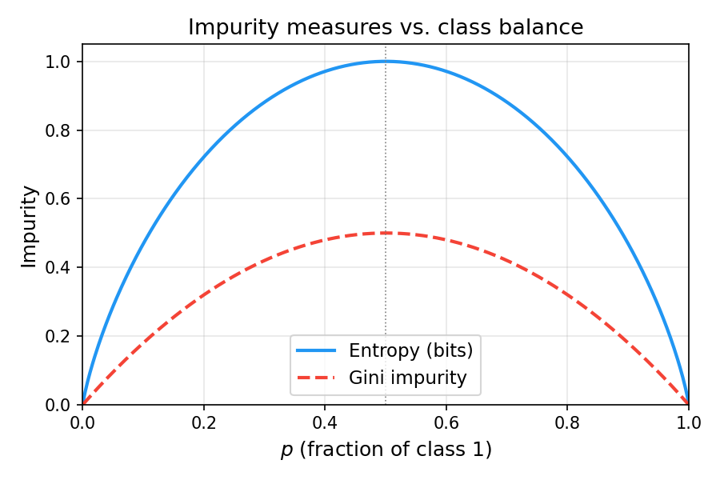
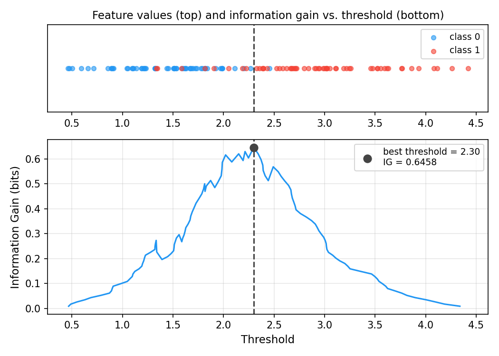
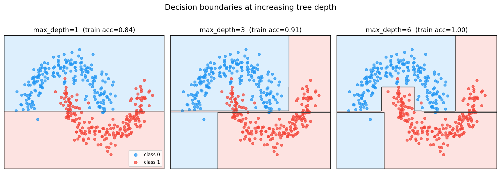
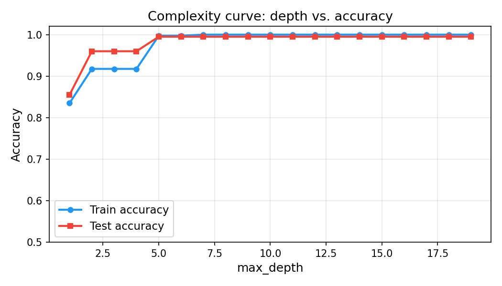
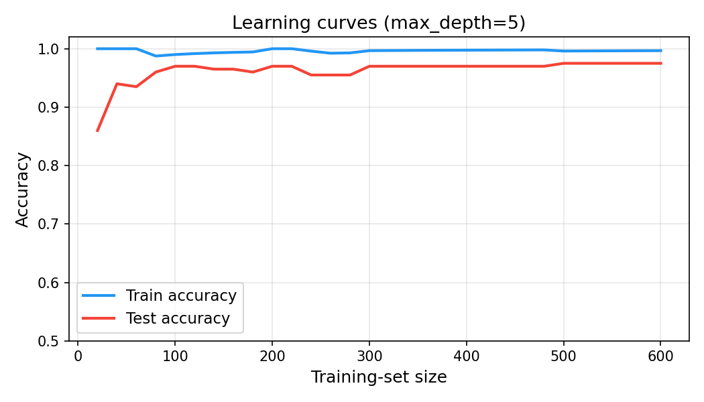

# Decision Trees — Math, Code, and Practice

A companion to [`decision_tree.py`](./decision_tree.py) and
[`impurity.py`](./impurity.py). The goal is to understand *why* decision trees
work the way they do — the information-theoretic foundation, the splitting
algorithm, its computational properties, and the bias-variance trade-off that
makes depth the central regularisation knob.

Math is rendered with LaTeX (`$...$`). GitHub, VS Code, and most modern
markdown viewers render this inline.

If you have not already, reading the
[logistic-regression companion doc](../logistic_regression.md) first is useful
for contrast: logistic regression and decision trees solve the same binary
classification problem from opposite philosophical starting points.

## Table of contents

1. [Introduction](#1-introduction)
2. [Entropy — measuring uncertainty](#2-entropy--measuring-uncertainty)
3. [Information gain](#3-information-gain)
4. [Gini impurity](#4-gini-impurity)
5. [The CART algorithm](#5-the-cart-algorithm)
6. [Worked example](#6-worked-example)
7. [No gradient descent — why trees are different](#7-no-gradient-descent--why-trees-are-different)
8. [Decision boundaries](#8-decision-boundaries)
9. [Overfitting and regularisation](#9-overfitting-and-regularisation)
10. [Extensions](#10-extensions)
11. [Further reading](#11-further-reading)

---

## 1. Introduction

A **decision tree** classifies a sample by asking a sequence of yes/no
questions about its features:

> Is feature 2 ≤ 1.3?
> — Yes → Is feature 0 ≤ −0.5? — Yes → class 0
> — No  → class 1

Each question corresponds to an **axis-aligned split** — a threshold on a
single feature. Tracing the answers from root to leaf gives the prediction.

Compared to logistic regression:

| | Logistic regression | Decision tree |
|:---|:---|:---|
| **Boundary shape** | flat hyperplane | axis-aligned staircase |
| **Training** | gradient descent (iterative) | greedy recursive splitting (one pass) |
| **Parameters** | weight vector $w$, bias $b$ | tree structure (splits + leaf values) |
| **Probabilistic output** | yes (sigmoid probability) | yes (leaf class fractions) |
| **Main regulariser** | L2 penalty / learning rate | max depth, min samples per split |

Decision trees are **non-parametric**: the model complexity grows with the
data, not with a fixed parameter count. A fully-grown tree can memorise every
training sample. Controlling depth is what keeps them honest.

---

## 2. Entropy — measuring uncertainty

### 2.1 Motivation

Before we can measure whether a split is *good*, we need to measure how
*impure* (uncertain, mixed) a node is. The ideal split takes a mixed node and
produces two purer children.

**Shannon entropy** gives us exactly this measure. It comes from information
theory: entropy $H(S)$ is the expected number of bits needed to encode the
class of a randomly drawn sample from node $S$.

### 2.2 Definition

Let $S$ be a set of $N$ samples. For binary classification with classes
$\{0, 1\}$, define:

$$p_1 = \frac{\text{count}(y = 1)}{N}, \qquad p_0 = 1 - p_1.$$

The **entropy** of $S$ is:

$$H(S) = -\sum_{k \in \{0,1\}} p_k \log_2 p_k
        = -p_0 \log_2 p_0 - p_1 \log_2 p_1.$$

By convention $0 \cdot \log_2 0 = 0$ (a pure class contributes zero uncertainty).

### 2.3 Properties



* **$H = 0$ at purity**: if all samples share one class ($p_1 = 0$ or
  $p_1 = 1$), entropy is 0 — there is nothing uncertain to encode.
* **$H = 1$ at maximum uncertainty**: when classes are balanced
  ($p_1 = 0.5$), entropy is 1 bit — you need one full coin-flip to encode
  each label.
* **Concavity**: $H$ is a concave function of $(p_0, p_1)$. This guarantees
  that any split of a mixed node into two children has a weighted-average
  child entropy *no greater than* the parent entropy — splitting can only
  reduce or preserve entropy, never increase it.

### 2.4 Worked calculation

Suppose a node has 10 samples: 7 in class 0, 3 in class 1.

$$p_0 = 0.7, \quad p_1 = 0.3$$

$$H = -0.7 \log_2(0.7) - 0.3 \log_2(0.3)
    = -0.7 \cdot (-0.515) - 0.3 \cdot (-1.737)
    \approx 0.360 + 0.521 = 0.881 \text{ bits}.$$

A perfectly balanced node ($p_0 = p_1 = 0.5$) has $H = 1$ bit. This node at
0.881 bits is fairly uncertain but not maximally so.

---

## 3. Information gain

### 3.1 Definition

Given a candidate split that divides node $S$ (size $N$) into a left child
$S_L$ (size $N_L$) and a right child $S_R$ (size $N_R = N - N_L$), the
**information gain** is:

$$\text{IG}(S, S_L, S_R) = H(S) - \frac{N_L}{N} H(S_L) - \frac{N_R}{N} H(S_R).$$

The weighted average of child entropies $\frac{N_L}{N} H(S_L) + \frac{N_R}{N} H(S_R)$
is the *expected entropy after the split* — imagine picking a random sample
from $S$ and asking "which child does it land in?". Information gain measures
how much that split reduces entropy on average.

Because $H$ is concave, IG $\geq 0$ always. A gain of 0 means the split
did not separate the classes at all; a gain of $H(S)$ means both children
are pure.

### 3.2 Why not just minimise child entropy?

You might wonder: why weight by child sizes? Why not just minimise
$H(S_L) + H(S_R)$?

The weighted form is correct because larger children contribute more to the
overall uncertainty. A split that creates one huge pure child and one tiny
impure child is *not* as good as one that creates two moderately pure
children of equal size, even if the unweighted sum of entropies is lower.
The weighted average reflects what actually happens to a randomly drawn
sample.

### 3.3 Split selection in code



[`impurity.best_split`](./impurity.py) sweeps every feature and every
candidate threshold to maximise IG. For a feature with $m$ distinct values,
there are $m - 1$ candidate thresholds (midpoints between adjacent values):

```
unique values: [1.0, 2.3, 4.7, 8.1]
candidate thresholds: [1.65, 3.5, 6.4]
```

Midpoints are sufficient — any threshold strictly between two consecutive
values produces an identical left/right partition, so finer granularity would
be redundant.

Total work for one node: $O(N n \log N)$ — sorting each feature ($O(N \log N)$)
times $n$ features — and $O(N)$ to evaluate each split. This makes the full
tree build $O(N n d \log N)$ for depth $d$.

---

## 4. Gini impurity

### 4.1 Definition

An alternative to entropy, **Gini impurity** is:

$$G(S) = 1 - \sum_{k} p_k^2 = 1 - p_0^2 - p_1^2.$$

For binary classification with $p_1 = p$:

$$G = 1 - p^2 - (1-p)^2 = 2p(1-p).$$

### 4.2 Gini gain

Exactly analogous to information gain:

$$\text{GG}(S, S_L, S_R) = G(S) - \frac{N_L}{N} G(S_L) - \frac{N_R}{N} G(S_R).$$

### 4.3 Entropy vs. Gini

Both measures produce nearly identical trees for binary classification. Their
Taylor expansions around $p = 0.5$ agree to second order. Practical
differences:

| | Entropy | Gini |
|:---|:---|:---|
| **Formula** | $-\sum p_k \log_2 p_k$ | $1 - \sum p_k^2$ |
| **Maximum (binary)** | 1 bit | 0.5 |
| **Computation** | slower (log) | faster (no log) |
| **Preference** | slightly penalises imbalanced splits | equally weights both sides |
| **Default in sklearn** | `criterion="entropy"` option | default `criterion="gini"` |

In practice, the choice rarely changes the resulting tree by more than one or
two nodes. Information gain is the classic information-theoretic choice and is
the default in this implementation (`criterion="entropy"`).

---

## 5. The CART algorithm

**CART** (Classification and Regression Trees, Breiman et al. 1984) is the
algorithm that builds a binary tree by greedy recursive splitting.

### 5.1 Pseudocode

```
function BUILD_TREE(X, y, depth):
    if STOP(X, y, depth):
        return LEAF(class_probs = count(y) / len(y))

    (j*, t*) = argmax_{j, t}  IG(y, y[X[:,j] <= t], y[X[:,j] > t])

    if IG(j*, t*) == 0:
        return LEAF(class_probs = count(y) / len(y))

    left  = BUILD_TREE(X[X[:,j*] <= t*], y[X[:,j*] <= t*], depth+1)
    right = BUILD_TREE(X[X[:,j*] >  t*], y[X[:,j*] >  t*], depth+1)
    return INTERNAL_NODE(feature=j*, threshold=t*, left=left, right=right)

function STOP(X, y, depth):
    return (depth >= max_depth)
        or (len(y) < min_samples_split)
        or (all samples share one class)
```

### 5.2 Greedy vs. optimal

CART is greedy: it picks the locally best split at each node without
backtracking. The globally optimal tree (the one that minimises total leaf
impurity over all possible tree structures) is NP-hard to find. Greedy CART
is an efficient approximation that works extremely well in practice.

### 5.3 Prediction

To classify a new sample $x$:

```
function PREDICT(node, x):
    if node is a leaf:
        return node.class_probs
    if x[node.feature] <= node.threshold:
        return PREDICT(node.left, x)
    else:
        return PREDICT(node.right, x)
```

The class-1 probability is `class_probs[1]`; apply a threshold (default 0.5)
to get a discrete label. This is what
[`decision_tree.predict`](./decision_tree.py) and `predict_class` implement.

---

## 6. Worked example

Consider this toy dataset with 2 features and 6 samples:

| Sample | $x_0$ | $x_1$ | $y$ |
|:---:|:---:|:---:|:---:|
| A | 2.0 | 3.0 | 0 |
| B | 1.0 | 1.5 | 0 |
| C | 3.5 | 2.0 | 0 |
| D | 4.0 | 4.5 | 1 |
| E | 5.0 | 1.0 | 1 |
| F | 6.0 | 3.5 | 1 |

**Root node** — 6 samples, 3 class-0, 3 class-1:

$$H(\text{root}) = -0.5 \log_2(0.5) - 0.5 \log_2(0.5) = 1.0 \text{ bit}.$$

**Candidate split: $x_0 \leq 3.75$**

Left ($x_0 \leq 3.75$): samples A, B, C → all class 0 → $H = 0$

Right ($x_0 > 3.75$): samples D, E, F → all class 1 → $H = 0$

$$\text{IG} = 1.0 - \tfrac{3}{6} \cdot 0 - \tfrac{3}{6} \cdot 0 = 1.0 \text{ bit}.$$

This is the maximum possible gain (perfectly separates the classes). The tree
stops here with two pure leaves:

```
x_0 <= 3.75?
  ├── YES → class 0 (prob=1.0)
  └── NO  → class 1 (prob=1.0)
```

**Prediction for new sample $x = [4.5, 2.0]$:**

$x_0 = 4.5 > 3.75$ → right branch → class 1 probability = 1.0 → predicted
label 1.

---

## 7. No gradient descent — why trees are different

Linear and logistic regression have a clear objective: minimise a
differentiable loss $L(w, b)$ over continuous parameters. Gradient descent
works because we can compute $\partial L / \partial w$ and take small steps
downhill.

Decision trees have no equivalent:

* **Parameters are discrete**: the tree structure (which feature, which
  threshold, which node gets which child) is a combinatorial object. You
  cannot take "half a split" or compute a derivative with respect to a
  threshold.
* **Loss landscape is not smooth**: moving a threshold by $\epsilon$ either
  changes the partition or it does not — the loss is piecewise-constant in
  the threshold, not smooth.
* **Global optimum is NP-hard**: exhaustive search over all tree structures
  is intractable for non-trivial problems.

The solution is the greedy top-down approach of CART: at each node, solve a
small, tractable optimisation (find the best single split) and recurse. This
is not global optimisation, but it is computationally efficient and produces
trees that generalise well.

The closest analogue to gradient descent for trees is **boosting**: building
many shallow trees sequentially, where each tree corrects the residuals of
the previous ones (see section 10).

---

## 8. Decision boundaries



Because splits are axis-aligned, decision tree boundaries are **piecewise
constant** in feature space — a union of axis-aligned rectangles. At depth 1
(a "decision stump") there is exactly one split, producing two half-planes.
As depth increases, the boundary becomes more jagged and can approximate
any function — but at the cost of higher variance.

Compare this to logistic regression's flat hyperplane: a logistic boundary
is globally smooth but can only be linear (unless you feed it polynomial
features). A decision tree can be arbitrarily nonlinear but is always
"staircase-shaped".

---

## 9. Overfitting and regularisation





A fully-grown decision tree (no max_depth limit) will always achieve 100%
training accuracy on any dataset: if the tree is allowed to grow until every
leaf is pure, it has memorised the training labels exactly. This is extreme
overfitting — the model has learned the noise, not the signal.

### Hyperparameters that control complexity

`max_depth` — the primary knob. Depth 1 is a single split (high bias); depth
$\infty$ is a fully memorised tree (high variance). The complexity curve above
shows the trade-off: test accuracy rises with depth, peaks, then falls as
variance takes over.

`min_samples_split` — prevents splits on tiny subsets. If a node has fewer
than `min_samples_split` samples, it becomes a leaf regardless of impurity.
Larger values act like a lower bound on tree size.

### Cost-complexity pruning

A more principled approach is **cost-complexity pruning** (also called weakest-link
pruning, α-pruning, or CCP). After building the full tree, iteratively remove
the internal node whose removal causes the smallest *increase* in training
impurity, weighted by a regularisation parameter $\alpha$:

$$\text{objective} = \sum_{\text{leaves}} \text{impurity}(\text{leaf}) + \alpha \cdot |\text{leaves}|.$$

For $\alpha = 0$ the full tree is optimal; as $\alpha \to \infty$ the tree
collapses to a single leaf. Cross-validate to find the best $\alpha$.
scikit-learn exposes this via `ccp_alpha`. This implementation does not
include pruning — `max_depth` and `min_samples_split` are sufficient for
learning the core concepts.

---

## 10. Extensions

### Random Forests

A single tree has high variance: small changes in the training data can
produce very different trees. **Random Forests** (Breiman 2001) reduce
variance by bagging:

1. Draw $B$ bootstrap samples of the training data (sample $N$ rows with
   replacement).
2. Fit a decision tree on each bootstrap sample, with one twist: at each
   node, only consider $m \approx \sqrt{n_{\text{features}}}$ randomly chosen
   features as candidates for the split (feature subsampling).
3. Aggregate predictions by averaging probabilities across the $B$ trees.

Feature subsampling decorrelates the trees — without it, every tree would
tend to split on the same dominant feature near the root, leaving the
ensemble correlated and the variance reduction limited.

### Gradient Boosted Trees

**Gradient Boosting** (Friedman 2001) builds trees sequentially rather than
in parallel:

1. Start with a constant prediction (e.g. the dataset mean for regression,
   or the log-odds for classification).
2. Compute the residuals (negative gradient of the loss with respect to the
   current predictions).
3. Fit a shallow tree to the residuals — this tree predicts *how wrong* the
   current ensemble is.
4. Add this tree to the ensemble, scaled by a learning rate.
5. Repeat for $B$ rounds.

This is gradient descent in function space: instead of updating parameter
vectors $w$, we add new functions (trees) that point in the negative gradient
direction. XGBoost, LightGBM, and CatBoost are all highly optimised
implementations of this idea and are among the most competitive models on
structured/tabular data.

### Feature importance

Decision trees provide a natural measure of **feature importance**: the total
information gain attributable to each feature across all splits in the tree,
weighted by the number of samples that passed through each split. Features
with high importance are the ones the tree relied on most. Random Forests
aggregate this over all $B$ trees, producing a stable importance estimate.

---

## 11. Further reading

* **Breiman et al. (1984)** — *Classification and Regression Trees*. The
  original CART monograph.
* **Bishop (2006)** — *Pattern Recognition and Machine Learning*, Chapter 14
  — a rigorous probabilistic treatment of trees and ensembles.
* **Hastie, Tibshirani & Friedman (2009)** — *The Elements of Statistical
  Learning*, Chapters 9 & 15 — covers CART, Random Forests, and Gradient
  Boosting in depth. Freely available online.
* **Friedman (2001)** — "Greedy Function Approximation: A Gradient Boosting
  Machine" — the foundational gradient-boosting paper.
* **Breiman (2001)** — "Random Forests" — the original Random Forests paper.
