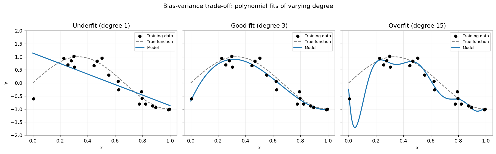
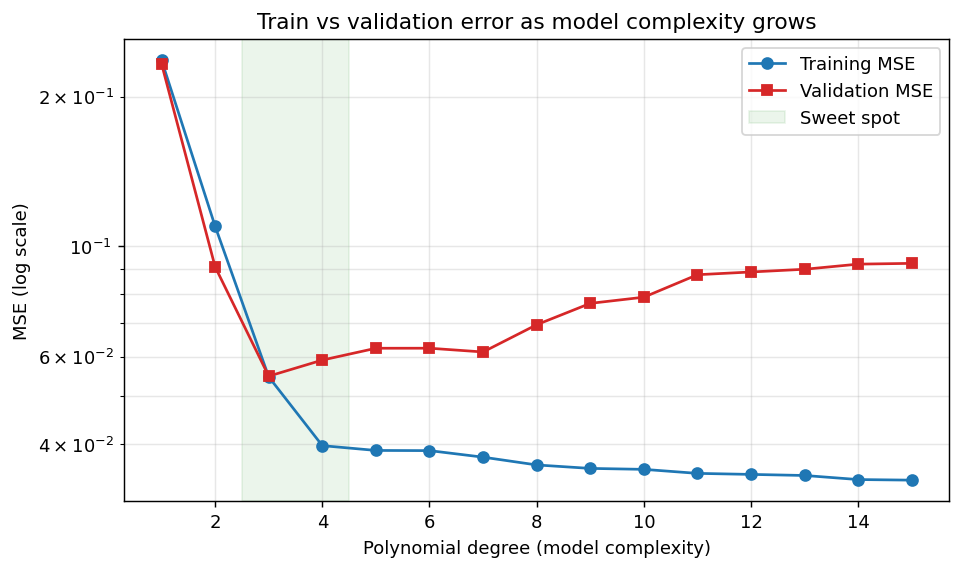
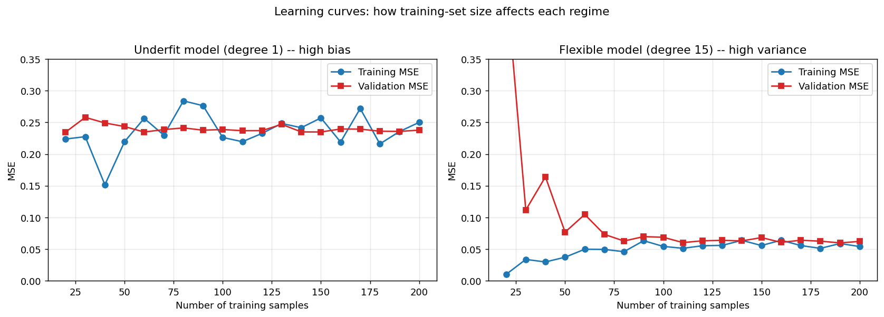
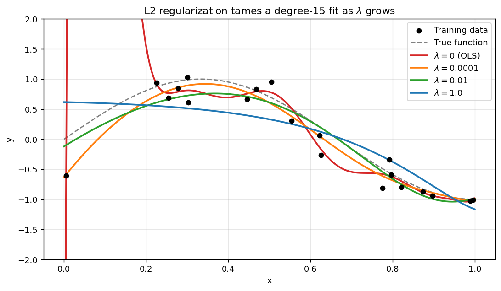

# Linear Regression — Math, Code, and Practice

A companion to [`linear_regression.py`](./linear_regression.py) and
[`loss.py`](./loss.py). The goal of this document is to walk through *why*
the code looks the way it does — the model, the loss functions, the
derivation of the gradients, the closed-form alternative, common extensions,
and the bias-variance trade-off that linear regression illustrates so well.

Math is rendered with LaTeX (`$...$`). GitHub, VS Code, and most modern
markdown viewers render this inline.

## Table of contents

1. [Introduction](#1-introduction)
2. [The model](#2-the-model)
3. [Loss functions](#3-loss-functions)
4. [Gradient descent](#4-gradient-descent)
5. [Gradient derivations](#5-gradient-derivations)
6. [Worked example](#6-worked-example)
7. [Closed-form alternative: the normal equation](#7-closed-form-alternative-the-normal-equation)
8. [Extensions](#8-extensions)
9. [Overfitting and underfitting](#9-overfitting-and-underfitting)
10. [Further reading](#10-further-reading)

---

## 1. Introduction

**Linear regression** models the relationship between a vector of inputs
$x \in \mathbb{R}^n$ and a scalar output $y \in \mathbb{R}$ as a linear
function plus noise:

$$y = x \cdot w + b + \varepsilon, \qquad \varepsilon \sim \mathcal{N}(0, \sigma^2).$$

The model has two assumptions baked in:

1. **Linearity** — the mean of $y$ given $x$ is a linear function of $x$.
2. **Additive noise** — observed values are scattered around that line/plane
   by some random error.

Despite its simplicity, linear regression is the right starting tool whenever
you suspect a roughly linear trend, want an interpretable model (each $w_j$
is "how much $y$ changes when feature $j$ increases by one"), or need a
fast baseline before reaching for something fancier.

---

## 2. The model

For one sample with $n$ features:

$$\hat{y}_i = x_i \cdot w + b = \sum_{j=1}^{n} x_{ij} w_j + b.$$

Stacking $N$ samples as rows of a matrix $X \in \mathbb{R}^{N \times n}$
turns the whole batch into a single matrix expression:

$$\hat{y} = X w + b,$$

where:

| Symbol | Shape | Meaning |
| :----- | :---- | :------ |
| $X$    | $(N, n)$ | input feature matrix — one row per sample |
| $w$    | $(n,)$   | weight vector — one weight per feature |
| $b$    | scalar   | bias / intercept |
| $\hat{y}$ | $(N,)$ | predictions |
| $y$    | $(N,)$   | true targets |

This is exactly what [`linear_regression.predict`](./linear_regression.py)
computes — see how `X @ self.w + self.b` is a single NumPy expression
that handles all $N$ samples without a Python loop.

---

## 3. Loss functions

A **loss function** measures how wrong the predictions are. Training picks
$w, b$ to minimize it. The three losses in [`loss.py`](./loss.py) are:

Define the residual vector $r = y - \hat{y}$, shape $(N,)$.

### Mean Squared Error (MSE)

$$L_{\text{MSE}}(w, b) = \frac{1}{N} \sum_{i=1}^{N} r_i^2$$

Smooth, differentiable everywhere, and the natural choice when noise is
roughly Gaussian (MSE is the negative log-likelihood up to constants).
Outliers are punished heavily because of the square.

### Root Mean Squared Error (RMSE)

$$L_{\text{RMSE}}(w, b) = \sqrt{\frac{1}{N} \sum_{i=1}^{N} r_i^2}\;=\;\sqrt{L_{\text{MSE}}}$$

Same optimum as MSE (square root is monotone), but reported in the units
of $y$, which makes it easier to interpret. Gradient picks up a $1/L$
factor from the chain rule.

### Mean Absolute Error (MAE)

$$L_{\text{MAE}}(w, b) = \frac{1}{N} \sum_{i=1}^{N} |r_i|$$

Robust to outliers — a residual of 10 contributes 10 (not 100). Not
differentiable at zero; we handle that with a subgradient
($\text{sign}(0) := 0$). The corresponding probabilistic assumption is
that noise is Laplace-distributed.

| Loss | Best when | Watch out for |
| :--- | :-------- | :------------ |
| MSE | noise is roughly Gaussian | a few big outliers dominate the gradient |
| RMSE | you want MSE's optimum but interpretable units | division by $L$ blows up if $L \to 0$ |
| MAE | data has outliers; you want the median, not the mean | non-smooth at 0; slower convergence near the minimum |

---

## 4. Gradient descent

Given any differentiable loss $L(\theta)$, **gradient descent** repeatedly
nudges the parameters in the direction of steepest decrease:

$$\theta \leftarrow \theta - \alpha \, \nabla_\theta L(\theta).$$

For linear regression $\theta = (w, b)$ and we apply this to each:

$$w \leftarrow w - \alpha \, \frac{\partial L}{\partial w}, \qquad
  b \leftarrow b - \alpha \, \frac{\partial L}{\partial b}.$$

The learning rate $\alpha > 0$ controls step size:

* **Too small** — convergence takes forever.
* **Too large** — steps overshoot the minimum, loss diverges.
* **Just right** — loss decreases steadily and plateaus near the optimum.

Each call to
[`linear_regression.train_one_step`](./linear_regression.py) implements
exactly this update. The convergence loop in
[`linear_regression.train`](./linear_regression.py) stops when either the
iteration cap is hit or successive errors differ by less than the cutoff.

---

## 5. Gradient derivations

We need $\partial L / \partial w_j$ and $\partial L / \partial b$ for each
loss. The starting point is shared:

$$\hat{y}_i = x_i \cdot w + b \;\;\Rightarrow\;\;
\frac{\partial r_i}{\partial w_j} = -x_{ij}, \qquad
\frac{\partial r_i}{\partial b} = -1.$$

### MSE

$$\frac{\partial L_{\text{MSE}}}{\partial w_j}
  = \frac{1}{N} \sum_i 2 r_i \cdot \frac{\partial r_i}{\partial w_j}
  = -\frac{2}{N} \sum_i r_i x_{ij}.$$

In matrix form (this is the key trick to remember):

$$\boxed{\;\nabla_w L_{\text{MSE}} = -\frac{2}{N} X^\top r, \qquad
         \frac{\partial L_{\text{MSE}}}{\partial b} = -\frac{2}{N} \sum_i r_i\;}$$

**Why $X^\top r$?** Look at the per-sample sum $\sum_i r_i x_{ij}$: it's
the dot product of the $j$-th column of $X$ (i.e. the $j$-th row of
$X^\top$) with $r$. Stacking over all $j$ gives the matrix-vector product
$X^\top r$, shape $(n,)$. That's why
`-(2.0 / N) * (X.T @ r)` in `loss.mse` replaces a Python loop over
samples and features.

### RMSE

Let $S = (1/N) \sum_i r_i^2$, so $L_{\text{RMSE}} = \sqrt{S}$. Chain
rule:

$$\frac{\partial L_{\text{RMSE}}}{\partial \theta}
  = \frac{1}{2\sqrt{S}} \cdot \frac{\partial S}{\partial \theta}
  = \frac{1}{2 L_{\text{RMSE}}} \cdot \frac{\partial S}{\partial \theta}.$$

The inner derivative $\partial S / \partial \theta$ is exactly what we just
derived for MSE. Substituting and simplifying the factor of 2:

$$\boxed{\;\nabla_w L_{\text{RMSE}} = -\frac{1}{N \cdot L_{\text{RMSE}}} X^\top r, \qquad
         \frac{\partial L_{\text{RMSE}}}{\partial b} = -\frac{1}{N \cdot L_{\text{RMSE}}} \sum_i r_i\;}$$

### MAE

$|x|$ isn't differentiable at 0, but for $x \neq 0$ we have
$d|x|/dx = \text{sign}(x)$. We extend to $x = 0$ via the *subgradient*
convention $\text{sign}(0) := 0$ — this is exactly what `np.sign`
returns. Then:

$$\frac{\partial L_{\text{MAE}}}{\partial w_j}
  = \frac{1}{N} \sum_i \text{sign}(r_i) \cdot (-x_{ij})
  = -\frac{1}{N} \sum_i x_{ij} \cdot \text{sign}(r_i).$$

In matrix form:

$$\boxed{\;\nabla_w L_{\text{MAE}} = -\frac{1}{N} X^\top \text{sign}(r), \qquad
         \frac{\partial L_{\text{MAE}}}{\partial b} = -\frac{1}{N} \sum_i \text{sign}(r_i)\;}$$

The structure is the same as MSE/RMSE; the only change is that the
residual vector $r$ is replaced with $\text{sign}(r)$. That makes
intuitive sense: MAE only cares about the *direction* of each error,
not its magnitude.

---

## 6. Worked example

A full end-to-end training run with three features:

```python
import numpy as np
from ml_from_scratch.regression.linear_regression import linear_regression

rng = np.random.default_rng(0)

# Synthesize data from a known linear model with small Gaussian noise.
true_w = np.array([2.0, -1.0, 0.5])
true_b = 4.0
X = rng.uniform(-1, 1, size=(500, 3))
y = X @ true_w + true_b + rng.normal(0, 0.05, size=500)

# Train.
lr = linear_regression(n_features=3, loss="MSE")
lr.train(alpha=0.05, X=X, y=y, max_iterations=5000, error_change_cutoff=1e-8)

# Inspect parameters and try a prediction.
print("Recovered w:", lr.w)         # ~ [ 2.00, -0.99, 0.50]
print("Recovered b:", lr.b)         # ~ 4.00
print("Predict:    ", lr.predict(np.array([[0.1, 0.2, -0.3]])))
```

Try the same loop with `loss="RMSE"` and `loss="MAE"` — all three should
recover the true $w$ and $b$ to within a small tolerance.

---

## 7. Closed-form alternative: the normal equation

For MSE specifically, you don't actually need gradient descent: there is
an analytic minimum.

**Setup.** Absorb the bias by prepending a column of ones to $X$:

$$\tilde{X} = [\mathbf{1} \; X] \in \mathbb{R}^{N \times (n+1)}, \qquad
  \tilde{w} = \begin{bmatrix} b \\ w \end{bmatrix} \in \mathbb{R}^{n+1}.$$

Then $\hat{y} = \tilde{X} \tilde{w}$ and

$$L_{\text{MSE}}(\tilde{w}) = \frac{1}{N} \| y - \tilde{X} \tilde{w} \|_2^2.$$

**Derivation.** Take the gradient w.r.t. $\tilde{w}$ and set it to zero:

$$\nabla_{\tilde{w}} L = -\frac{2}{N} \tilde{X}^\top (y - \tilde{X} \tilde{w}) = 0
\;\Longleftrightarrow\;
\tilde{X}^\top \tilde{X} \, \tilde{w} = \tilde{X}^\top y.$$

This is the **normal equation**. If $\tilde{X}^\top \tilde{X}$ is
invertible, the unique solution is

$$\boxed{\;\tilde{w}^* = (\tilde{X}^\top \tilde{X})^{-1} \tilde{X}^\top y.\;}$$

**In code:**

```python
import numpy as np

# Same synthetic data as section 6.
rng = np.random.default_rng(0)
true_w, true_b = np.array([2.0, -1.0, 0.5]), 4.0
X = rng.uniform(-1, 1, size=(500, 3))
y = X @ true_w + true_b + rng.normal(0, 0.05, size=500)

# Augment X with a leading column of ones to absorb the bias.
X_aug = np.hstack([np.ones((X.shape[0], 1)), X])

# Solve. np.linalg.solve is more numerically stable than computing the inverse;
# np.linalg.pinv (the pseudoinverse) is the safest fallback if X^T X is singular.
w_aug = np.linalg.solve(X_aug.T @ X_aug, X_aug.T @ y)

b_closed = w_aug[0]
w_closed = w_aug[1:]
print(w_closed, b_closed)   # ~ [2.00, -1.00, 0.50] and 4.00
```

**When to prefer which?**

| Method | Pros | Cons |
| :----- | :--- | :--- |
| Normal equation | Exact, one shot, no hyperparameters | $O(n^3)$ to invert; needs all data in memory; only works for squared loss; fails if $\tilde{X}^\top \tilde{X}$ is singular (use `np.linalg.pinv` or add ridge regularization) |
| Gradient descent | Scales to huge $N$ or $n$; works with any differentiable loss; supports online / mini-batch updates; pairs with regularization, dropout, etc. | Iterative; needs learning-rate tuning; only converges to a stationary point |

The two agree exactly (up to floating-point) for MSE on small problems.
For MAE there is *no* closed form — gradient descent (or specialized
solvers like linear programming) is required.

---

## 8. Extensions

The class in this repo is intentionally minimal. Here is the landscape
of common extensions and where each would slot in. None of them are
implemented; each section names what to change.

### Decaying learning rate

A constant $\alpha$ is a compromise: big enough to make progress early,
small enough to settle at the end. Decay schedules give you both:

* **Step decay** — multiply $\alpha$ by some factor (e.g. 0.5) every $K$
  epochs.
* **Exponential decay** — $\alpha_t = \alpha_0 \cdot e^{-\gamma t}$.
* **$1/t$ decay** — $\alpha_t = \alpha_0 / (1 + \gamma t)$. Classic
  guarantee territory (Robbins–Monro).

Slot in: pass a schedule (or `(iteration) -> float`) into `train` and
multiply by it inside the loop.

### Mini-batch gradient descent

Instead of computing the gradient on all $N$ samples each step (which
is what this repo does — sometimes called *batch* or *full-batch* GD),
use a random subset of $B$ samples (typically 32–512). This trades a
noisier gradient for faster wall-clock progress, lower memory use, and
the regularizing effect of noise.

Slot in: inside `train`, shuffle indices each epoch and call
`train_one_step` on each batch slice of $X$ and $y$.

### Stochastic gradient descent (SGD)

The $B = 1$ extreme: update on one sample at a time. Very noisy
gradients (in the long run unbiased), can escape shallow local minima,
and supports true online learning. Linear regression's loss is convex
so noise mostly just slows convergence — SGD really shines for non-convex
losses (neural nets).

### Momentum, Adam, RMSProp

Optimizers that augment plain GD with extra state. A few highlights:

* **Momentum** — accumulate a velocity vector $v \leftarrow \beta v + (1-\beta) g$
  and step with $\theta \leftarrow \theta - \alpha v$. Damps oscillations
  in ill-conditioned loss landscapes.
* **RMSProp** — divide each parameter's gradient by a running RMS of past
  gradients. Adapts the effective learning rate per parameter.
* **Adam** — momentum + RMSProp, with bias correction. The "just works"
  default for modern deep learning.

For convex MSE you rarely *need* anything beyond plain GD with a tuned
learning rate, but feature-scale mismatch (see below) often justifies
Adam in practice.

### L2 (Ridge) and L1 (Lasso) regularization

Add a penalty on the size of $w$ to the loss:

* **Ridge:** $L \to L + \lambda \|w\|_2^2$. Closed form:
  $w = (X^\top X + \lambda I)^{-1} X^\top y$. Shrinks weights smoothly.
  Always invertible — fixes the singular case of plain OLS.
* **Lasso:** $L \to L + \lambda \|w\|_1$. No closed form; not smooth at
  0. Encourages exact zeros — performs feature selection.

Slot in: add `+ 2 * lam * self.w` to `delta_w` (ridge) or
`+ lam * np.sign(self.w)` (lasso). The bias is typically *not*
regularized.

### Elastic Net

A weighted combination of L1 and L2:
$L \to L + \lambda_1 \|w\|_1 + \lambda_2 \|w\|_2^2$. Gets you the
feature-selection behaviour of Lasso with the stability of Ridge.

### Feature scaling / standardization

Gradient descent treats every parameter with the same learning rate. If
one feature has variance 1000 and another has variance 0.001, the loss
surface is a long thin ellipse — GD zig-zags. Standardizing each
feature to zero mean and unit variance turns it into a near-circle and
the same $\alpha$ works for everything.

Always scale features before GD. Closed-form OLS is invariant to scale
(except for numerical conditioning), so this matters less there.

### Polynomial features

"Linear" only means linear *in the parameters*. Replace each $x$ with
$[1, x, x^2, \ldots, x^d]$ and you can fit polynomials, sinusoids,
products of features — anything you can hand-craft — using the exact
same linear-regression machinery. See section 9 for what happens when
you crank $d$ up too far.

### Early stopping

Hold out a validation set; stop training when validation loss stops
improving. Cheap regularizer that mostly matters for high-capacity
models trained with GD (overfitting takes time to set in).

### Weight initialization strategies

For pure linear regression with a convex loss, initialization doesn't
matter — every starting point reaches the same minimum. (This file
initializes `w = ones`, `b = 0`, which is fine.) For deeper models,
strategies like Xavier (Glorot) and He initialization matter a lot.

---

## 9. Overfitting and underfitting

Linear regression on **polynomial features** is the canonical example
of the bias-variance trade-off. Below, the "true" function is a smooth
sinusoid; we draw a small noisy dataset from it, then fit polynomials
of varying degree.

Figures are generated by [`generate_plots.py`](./generate_plots.py) — run
`python generate_plots.py` to regenerate.

### Underfit, good fit, overfit



* **Degree 1** — too inflexible to capture the curve. High *bias*: the
  model is systematically wrong everywhere. Train and validation error
  are both high.
* **Degree 3** — about right. Captures the trend without chasing noise.
* **Degree 15** — flexible enough to wiggle through almost every training
  point, including the noise. High *variance*: tiny changes to the
  training data would produce a wildly different fit. Predictions
  outside the dense data are nonsensical.

The matplotlib code for this figure (abbreviated):

```python
import numpy as np
import matplotlib.pyplot as plt

def true_function(x): return np.sin(1.5 * np.pi * x)

rng = np.random.default_rng(7)
x_train = rng.uniform(0, 1, size=20)
y_train = true_function(x_train) + rng.normal(0, 0.25, size=20)

x_dense = np.linspace(0, 1, 400)
for deg in (1, 3, 15):
    X = np.vander(x_train, N=deg + 1, increasing=True)
    w = np.linalg.pinv(X.T @ X) @ X.T @ y_train
    plt.plot(x_dense, np.vander(x_dense, N=deg + 1, increasing=True) @ w)
plt.scatter(x_train, y_train, color="black")
plt.show()
```

### The complexity curve



Sweep degree from 1 to 15 and plot the resulting train and validation
MSE. The two curves tell different stories:

* **Training error decreases monotonically.** A more flexible model can
  always fit the training data better — *given enough degrees of
  freedom, a polynomial can interpolate any finite dataset exactly,
  driving training MSE to zero*.
* **Validation error is U-shaped.** Initially better as the model gets
  flexible enough to capture the true signal, then worse as the extra
  flexibility starts fitting noise.

The gap between train and validation is the **generalization gap**.
Cross-validation is just the principled way to pick the bottom of the U.

### Learning curves



How does each model behave as you give it more training data?

* **Underfit (degree 1, left):** train and validation error are both
  high and they converge to the same value almost immediately. The model
  is so inflexible that more data doesn't help — its error is dominated
  by *bias*. The fix is a more flexible model, not more data.
* **Flexible (degree 15, right):** train error stays low, validation
  error starts high (overfitting on small datasets) and decreases as
  $N$ grows. The gap is dominated by *variance*. The fix is more data
  (or regularization).

This is a useful diagnostic in practice: plot learning curves, and the
shape tells you whether you should reach for more capacity, more data,
or more regularization.

### Regularization tames overfitting



Same degree-15 polynomial as before, but with L2 ridge penalty
$\lambda \|w\|_2^2$ added to the loss. As $\lambda$ grows, the
fit smoothly transitions from extreme overfit (red, $\lambda = 0$, plain
OLS — shoots off the chart at the boundaries) to extreme underfit (blue,
$\lambda = 1$, nearly flat). The closed form is

$$w = (X^\top X + \lambda I)^{-1} X^\top y,$$

and the bias column is conventionally left unpenalized.

The right $\lambda$ is whatever minimizes validation MSE; in this
example $\lambda \approx 10^{-2}$ (green) closely recovers the true
function despite having 16 polynomial features and only 20 noisy
training points.

---

## 10. Further reading

* Hastie, Tibshirani, Friedman — *The Elements of Statistical Learning*,
  chapter 3. The definitive linear-models reference.
* Bishop — *Pattern Recognition and Machine Learning*, chapter 3. Bayesian
  perspective on linear regression and regularization.
* [scikit-learn user guide: linear models](https://scikit-learn.org/stable/modules/linear_model.html)
  — production-grade reference implementations of everything in section 8.
* Goodfellow, Bengio, Courville — *Deep Learning*, chapter 5. Frames
  linear regression as the simplest case of supervised learning before
  generalizing.
